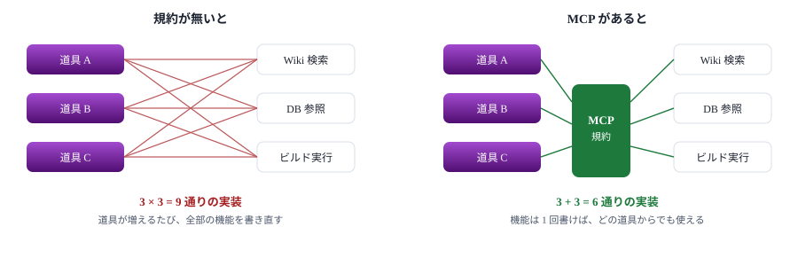
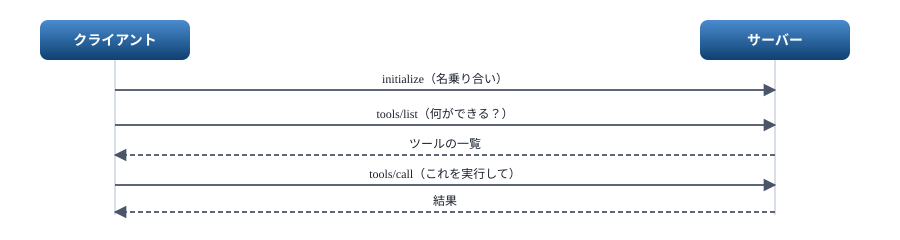
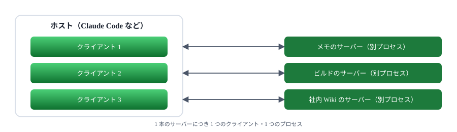
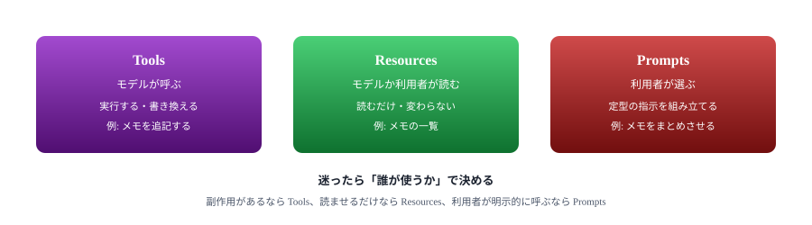
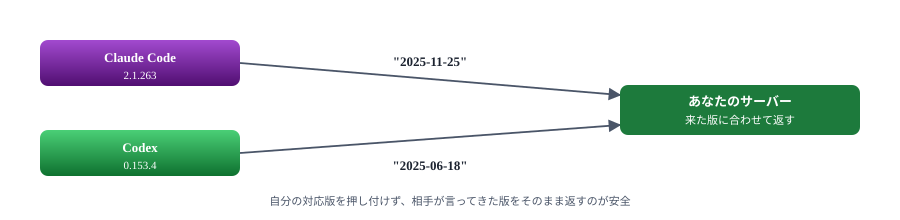

# 01. 背景

MCP が何のために作られ、何を運ぶ規約なのか

> 📅 作成: 2026-09-07 / 更新: 2026-09-07

[目次](../README.md)

[02. 最小のサーバー](02-最小のサーバー.md)

## この資料の内容

1. [つなぎ方がバラバラだった頃](#1-つなぎ方がバラバラだった頃)
2. [MCP が運ぶもの](#2-mcp-が運ぶもの)
3. [ホスト・クライアント・サーバー](#3-ホストクライアントサーバー)
4. [サーバーが出せる 3 つのもの](#4-サーバーが出せる-3-つのもの)
5. [版は 1 つではない](#5-版は-1-つではない)

## 1. つなぎ方がバラバラだった頃

AI に手元の情報を使わせたい、AI に何か作業をさせたい。これを実現する方法は前からありました。ただし**つなぎ方が道具ごとに違いました**。

ある編集ソフトは独自の拡張の書き方を決めていて、別のチャットアプリはまた違う書き方を決めている。同じ「社内の Wiki を検索する」機能を作るのに、対応したい道具の数だけ書き直すことになります。



道具と機能の組み合わせが増えるほど差が開く。MCP は間に規約を 1 枚挟んで、掛け算を足し算に変える。

MCP（Model Context Protocol）は、この**間に挟む規約**です。機能を提供する側を「MCP サーバー」として 1 回書けば、規約に対応した道具ならどれからでも呼べます。

> [!NOTE]
> <strong>似た考え方が先にあります。</strong>エディタとプログラミング言語の間を取り持つ LSP（Language Server Protocol）です。MCP はこれを参考にしていると仕様に書かれています。「エディタ × 言語」を「エディタ ＋ 言語」に変えたのと同じことを、「AI アプリ × 機能」でやっています。

## 2. MCP が運ぶもの

MCP の中身は **JSON-RPC 2.0** です。特別な形式ではなく、JSON でリクエストを送り、JSON でレスポンスを受け取るだけの、古くからある取り決めです。

### 実際に流れているもの

ツールを 1 回呼ぶと、こういう JSON が 1 行流れます。

```json
{"jsonrpc":"2.0","id":2,"method":"tools/call","params":{"name":"add","arguments":{"a":2,"b":3}}}
```

返ってくるのはこれです。

```json
{"jsonrpc":"2.0","id":2,"result":{"content":[{"type":"text","text":"5"}]}}
```

これがすべてです。`id` で送ったものと返ったものを対応付け、`method` で何をするかを決める。次の章では、この 2 行を自分の手で組み立てます。



やりとりは必ずクライアントから始まる。サーバーが勝手に話しかけることはできない。

> [!NOTE]
> <strong>始めるのは必ずクライアント側です。</strong>サーバーは訊かれたことに答えるだけで、自分から「これをやってくれ」と頼むことはできません。この非対称は最後まで効いてくるので、頭の隅に置いてください。[08. 通知で伝える](08-通知で伝える.md) で詳しく扱います。

## 3. ホスト・クライアント・サーバー

MCP の話には 3 つの登場人物が出てきます。混同しやすいので、最初に押さえます。

| 呼び名 | 何か | 例 |
|---|---|---|
| ホスト | AI を動かしているアプリそのもの | Claude Code、Codex、Antigravity |
| クライアント | ホストの中にある、サーバー 1 本ごとの接続係 | （利用者からは見えない） |
| サーバー | 機能を提供する側。**これから作るもの** | メモを検索する、ビルドを走らせる |

**サーバー 1 本につきクライアントが 1 つ**付きます。3 本のサーバーを登録すれば、ホストの中に 3 つのクライアントができ、3 つのプロセスが起動します。



サーバーは別のプロセスとして動く。落ちてもホストは巻き添えにならない代わり、起動の数だけ資源を使う。

### 相手は名乗ってくる

接続すると、ホストは自分が何者かを伝えてきます。次は Claude Code から実際に届いたものです（読みやすく改行しています）。

```json
{
  "method": "initialize",
  "params": {
    "protocolVersion": "2025-11-25",
    "capabilities": { "roots": { "listChanged": true }, "elicitation": {} },
    "clientInfo": {
      "name": "claude-code",
      "title": "Claude Code",
      "version": "2.1.263"
    }
  },
  "jsonrpc": "2.0",
  "id": 0
}
```

`capabilities` は**相手にできること**の申告です。ここに書かれていない機能は、こちらから使ってはいけません。

## 4. サーバーが出せる 3 つのもの

サーバーが提供できるものは 3 種類です。**誰が使うか**で分かれています。



3 つの違いは機能の大小ではなく、使い手が誰かにある。

> [!NOTE]
> <strong>まず Tools だけで足ります。</strong>実際に公開されているサーバーの多くは Tools しか持っていません。Resources と Prompts は [05. 3 つの提供物](05-3つの提供物.md) で扱います。

## 5. 版は 1 つではない

MCP の仕様には日付の付いた版があります。そして**ホストによって喋る版が違います**。これは最初に知っておくべき現実です。

### 実測した結果

同じサーバーに 2 つのホストから繋いで、届いた `protocolVersion` を記録しました。

| ホスト | 版 | 名乗った能力 |
|---|---|---|
| Claude Code 2.1.263 | 2025-11-25 | `roots` ・ `elicitation` |
| Codex 0.153.4 | 2025-06-18 | `elicitation`（form と url） |



同じサーバーに、違う版のホストが繋いでくる。片方に合わせて決め打ちにすると、もう片方で動かなくなる。

### この資料が対象にする版

**2025-11-25** を基準にします。手元の Claude Code が喋る版であり、実際に動かして確かめられるからです。

> [!NOTE]
> <strong>2026-07-28 という、もっと新しい版もあります。</strong>ただし作りが大きく変わっており（接続ごとの状態を持たない、サーバーからのリクエストが無くなる）、**今のところどの CLI もそこまで追いついていません**。仕様を読むときは、自分が見ているページの日付を必ず確かめてください。

### 版が違っても、作り方はほぼ同じ

安心してよい点として、`tools/list` でツールを並べ、`tools/call` で実行する、という骨格はどの版でも変わりません。違いが出るのは、通知・タスク・サーバーからの問いかけといった応用の部分です。

次の章では、この骨格だけを持つサーバーを、ライブラリを使わずに書きます。

[目次](../README.md)

[02. 最小のサーバー](02-最小のサーバー.md)
