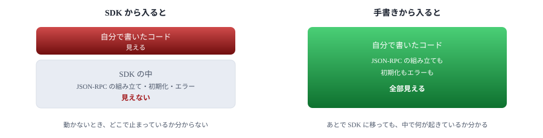
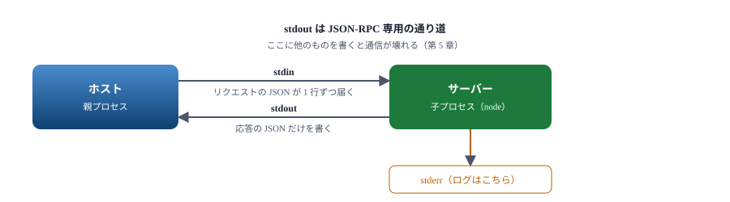
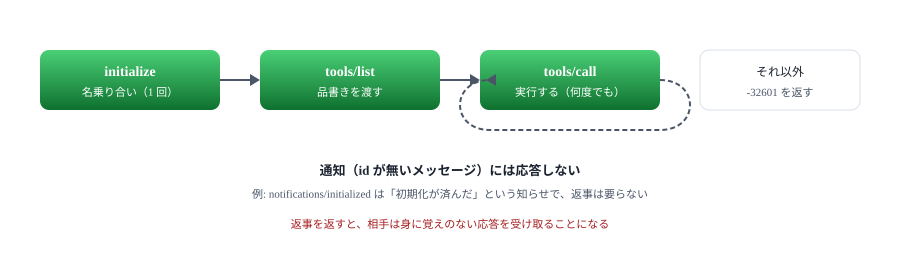
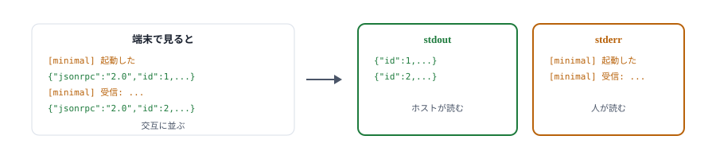
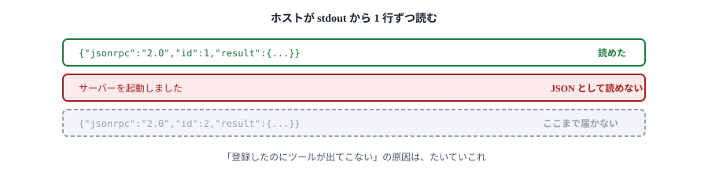

# 02. 最小のサーバー

ライブラリを使わず、JSON-RPC を手で組み立てて動かす

> 📅 作成: 2026-09-07 / 更新: 2026-09-07

[01. 背景](01-背景.md)

[目次](../README.md)

[03. SDK で書き直す](03-SDKで書き直す.md)

## この資料の内容

1. [なぜ手で書くのか](#1-なぜ手で書くのか)
2. [標準入出力でやりとりする](#2-標準入出力でやりとりする)
3. [3 つのメソッドに答える](#3-3-つのメソッドに答える)
4. [動かす](#4-動かす)
5. [stdout を汚さない](#5-stdout-を汚さない)

## 1. なぜ手で書くのか

MCP には公式の SDK があり、次の章ではそれを使います。ここで**あえて手で書く**のには理由があります。

SDK を使うと 20 行ほどでサーバーが完成します。ところが、いざホストに登録して動かないとき、**どこまで届いているのかが分かりません**。プロセスは起動しているのか。初期化まで進んだのか。ツールの一覧は渡ったのか。SDK の内側で起きていることが見えないと、切り分けようがありません。

この章で JSON-RPC を 1 往復させておけば、以降どの章で詰まっても「どこまで来ているか」を自分で確かめられます。**15 分の投資で、残りの時間が助かります。**



この章で見た景色が、以降すべての章の土台になる。

## 2. 標準入出力でやりとりする

MCP には運び方（トランスポート）が 2 つあります。ここで使うのは **stdio** です。

| 運び方 | やっていること | いつ使うか |
|---|---|---|
| stdio | ホストがサーバーを子プロセスとして起動し、その標準入出力に JSON を 1 行ずつ流す | 手元の PC で動かすとき。**まずこれ** |
| Streamable HTTP | 1 つの URL に HTTP POST する | 別のマシンに置くとき、1 本を共有するとき |

stdio の実体は**改行区切りの JSON**です。特別なライブラリは要りません。



ログを出したくなったら stderr へ。stdout は 1 行 1 メッセージの通り道として空けておく。

### 受け取る側の骨組み

```javascript
import { createInterface } from 'node:readline';

// stdout は JSON-RPC 専用。ログは stderr へ出す
function log(...args) {
	console.error('[minimal]', ...args);
}

// 1 メッセージ 1 行。末尾の改行が区切りになる
function send(message) {
	process.stdout.write(JSON.stringify(message) + '\n');
}

const rl = createInterface({ input: process.stdin });

rl.on('line', (line) => {
	if (!line.trim()) return;
	const request = JSON.parse(line);
	// ここで処理する
});
```

`readline` が改行で区切ってくれるので、こちらは 1 行ずつ受け取るだけです。

## 3. 3 つのメソッドに答える

最低限のサーバーが答えるべきメソッドは 3 つです。

| メソッド | 訊かれていること | いつ来るか |
|---|---|---|
| `initialize` | あなたは誰で、何ができますか | 接続の直後に 1 回 |
| `tools/list` | どんなツールを持っていますか | 初期化の後 |
| `tools/call` | このツールを実行してください | モデルが使うたび |



通知とリクエストの見分けは `id` の有無だけ。ここを取り違えると、繋がっているのに動かない状態になる。

### ツールの品書き

`tools/list` で返す内容です。`inputSchema` は JSON Schema で書きます。**モデルはこの説明だけを頼りに呼ぶ**ので、`description` は人に説明するつもりで書きます。

```javascript
const TOOLS = [
	{
		name: 'add',
		description: '2 つの数を足す',
		inputSchema: {
			type: 'object',
			properties: {
				a: { type: 'number', description: '1 つめの数' },
				b: { type: 'number', description: '2 つめの数' },
			},
			required: ['a', 'b'],
		},
	},
];
```

### 3 つに答える

```javascript
function handle(request) {
	const { id, method, params } = request;

	switch (method) {
		// ホストが最初に送ってくる。名乗り合いをする
		case 'initialize':
			return reply(id, {
				// 相手が送ってきたバージョンをそのまま返す
				protocolVersion: params?.protocolVersion ?? '2025-06-18',
				capabilities: { tools: {} },
				serverInfo: { name: 'minimal', version: '1.0.0' },
			});

		// 提供するツールの一覧を返す
		case 'tools/list':
			return reply(id, { tools: TOOLS });

		// ツールを実行する
		case 'tools/call': {
			if (params?.name !== 'add') {
				return replyError(id, -32602, `unknown tool: ${params?.name}`);
			}
			const { a, b } = params.arguments ?? {};
			if (typeof a !== 'number' || typeof b !== 'number') {
				// 引数が不正なときは、プロトコルのエラーではなく結果として返す
				return reply(id, {
					content: [{ type: 'text', text: 'a と b には数値を渡してください' }],
					isError: true,
				});
			}
			return reply(id, {
				content: [{ type: 'text', text: String(a + b) }],
			});
		}

		default:
			return replyError(id, -32601, `method not found: ${method}`);
	}
}
```

> [!NOTE]
> **相手が言ってきた版をそのまま返します。**`params?.protocolVersion ?? '2025-06-18'` としているのはそのためです。[01. 背景](01-背景.md) で見たとおり、ホストによって版が違います。自分の対応版を押し付けると、片方で繋がらなくなります。

> [!NOTE]
> <strong>ツールの失敗は `isError` で返します。</strong>JSON-RPC のエラー（`error`）にすると「サーバーが壊れた」扱いになり、モデルには理由が伝わりません。`isError: true` と本文を返せば、モデルはそれを読んで引数を直し、もう一度呼べます。**直せる失敗は結果として返す**のが原則です。

全体は [samples/02-minimal/server.mjs](samples/02-minimal/server.mjs) にあります。90 行ほどです。

## 4. 動かす

ホストに登録する前に、手で叩いて確かめます。標準入力に JSON を流し込むだけです。

```powershell
@(
'{"jsonrpc":"2.0","id":1,"method":"initialize","params":{"protocolVersion":"2025-11-25","capabilities":{},"clientInfo":{"name":"手","version":"1.0"}}}'
'{"jsonrpc":"2.0","method":"notifications/initialized"}'
'{"jsonrpc":"2.0","id":2,"method":"tools/list"}'
'{"jsonrpc":"2.0","id":3,"method":"tools/call","params":{"name":"add","arguments":{"a":2,"b":3}}}'
) -join "`n" | node server.mjs
```

実際の出力です。

```text
[minimal] 起動した
[minimal] 受信: {"jsonrpc":"2.0","id":1,"method":"initialize",...}
{"jsonrpc":"2.0","id":1,"result":{"protocolVersion":"2025-11-25","capabilities":{"tools":{}},"serverInfo":{"name":"minimal","version":"1.0.0"}}}
[minimal] 受信: {"jsonrpc":"2.0","method":"notifications/initialized"}
[minimal] 通知: notifications/initialized
[minimal] 受信: {"jsonrpc":"2.0","id":2,"method":"tools/list"}
{"jsonrpc":"2.0","id":2,"result":{"tools":[{"name":"add","description":"2 つの数を足す",...}]}}
[minimal] 受信: {"jsonrpc":"2.0","id":3,"method":"tools/call",...}
{"jsonrpc":"2.0","id":3,"result":{"content":[{"type":"text","text":"5"}]}}
```

`[minimal]` が付いている行は stderr、付いていない行が stdout です。**混ざって見えていても、実際には別の流れ**です。



端末では 1 つに見えるが、ホストが読むのは stdout だけ。

## 5. stdout を汚さない

MCP サーバーで最も多い事故がこれです。

```javascript
// これをやると壊れる
console.log('サーバーを起動しました');
```

`console.log` は stdout に書きます。stdout は JSON-RPC の通り道なので、ホストはこの行を**メッセージとして読もうとします**。JSON として読めないので、その接続は成立しません。



1 行の `console.log` で接続ごと落ちる。しかもホスト側には「繋がらない」としか出ない。

### 対策

| やること | 書き方 |
|---|---|
| ログを出す | `console.error(...)` を使う。`console.log` は使わない |
| ライブラリの出力を抑える | 読み込んだライブラリが `console.log` する場合がある。疑わしければファイルに記録する形に変える |
| 確かめる | 手で動かして、stdout に JSON 以外が出ていないか目で見る |

> [!NOTE]
> **この癖は stdio のときだけ必要です。**[07. HTTP に載せ替える](07-HTTPに載せ替える.md) で扱う HTTP 版では、標準出力は空いているので `console.log` を使えます。同じサーバーでも運び方で作法が変わります。

### 次の章へ

ここまでで、MCP サーバーが何をしているかは全部見えました。次は同じものを SDK で書き直し、**何が省けるのか**を確かめます。

[01. 背景](01-背景.md)

[目次](../README.md)

[03. SDK で書き直す](03-SDKで書き直す.md)
