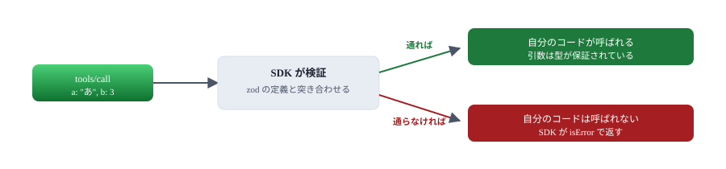
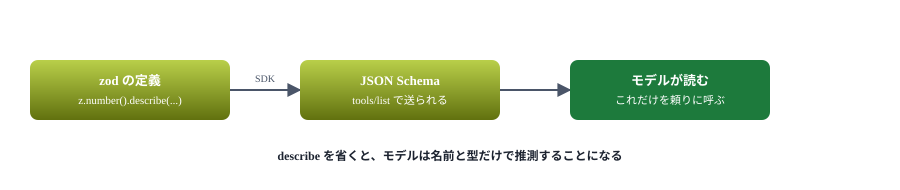
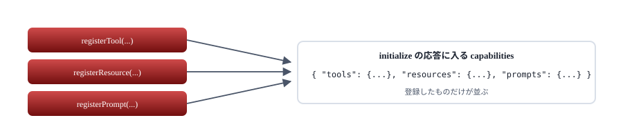

# 03. SDK で書き直す

同じサーバーを公式 SDK で書き、何が省けたのかを確かめる

> 📅 作成: 2026-09-07 / 更新: 2026-09-07

[02. 最小のサーバー](02-最小のサーバー.md)

[目次](../README.md)

[04. ホストに登録する](04-ホストに登録する.md)

## この資料の内容

1. [用意する](#1-用意する)
2. [20 行で同じものになる](#2-20-行で同じものになる)
3. [何が省けたか](#3-何が省けたか)
4. [入力の形は zod で書く](#4-入力の形は-zod-で書く)
5. [SDK が黙って足すもの](#5-sdk-が黙って足すもの)

## 1. 用意する

### 入れるもの

```powershell
npm init -y
npm install @modelcontextprotocol/sdk
```

`zod` は SDK が依存しているので一緒に入りますが、自分のコードから直接使うので明示しておきます。

```json
{
	"dependencies": {
		"@modelcontextprotocol/sdk": "^1.30.0",
		"zod": "^4.5.4"
	}
}
```

### この資料を書いた時点の版

| もの | 版 | 確かめ方 |
|---|---|---|
| Node.js | v26.8.1 | `node --version` |
| npm | 11.19.0 | `npm --version` |
| SDK | 1.30.0 | `npm view @modelcontextprotocol/sdk version` |
| zod | 4.5.4 | `npm ls zod` |


02 章で手書きした部分の大半が、真ん中の層に収まる。

## 2. 20 行で同じものになる

[samples/03-sdk/server.mjs](samples/03-sdk/server.mjs) の全文です。02 章の 90 行と同じことをします。

```javascript
import { McpServer } from '@modelcontextprotocol/sdk/server/mcp.js';
import { StdioServerTransport } from '@modelcontextprotocol/sdk/server/stdio.js';
import { z } from 'zod';

const server = new McpServer({
	name: 'sdk',
	version: '1.0.0',
});

server.registerTool(
	'add',
	{
		title: '足し算',
		description: '2 つの数を足す',
		// 入力の形は zod で書く。JSON Schema には SDK が変換して送る
		inputSchema: {
			a: z.number().describe('1 つめの数'),
			b: z.number().describe('2 つめの数'),
		},
	},
	async ({ a, b }) => ({
		content: [{ type: 'text', text: String(a + b) }],
	}),
);

// stdio に繋ぐ。ここで初めて標準入出力を読み書きし始める
await server.connect(new StdioServerTransport());
```

02 章と同じ手順で動かせます。

```text
{"result":{"protocolVersion":"2025-11-25","capabilities":{"tools":{"listChanged":true}},"serverInfo":{"name":"sdk","version":"1.0.0"}},"jsonrpc":"2.0","id":1}
{"result":{"content":[{"type":"text","text":"5"}]},"jsonrpc":"2.0","id":3}
```


SDK が肩代わりするのは、どのサーバーにも共通の定型部分だけ。

## 3. 何が省けたか

| 02 章で書いていたこと | SDK では |
|---|---|
| `initialize` への応答 | 不要。`McpServer` が答える |
| 通知（`id` 無し）の判別 | 不要。SDK が振り分ける |
| `capabilities` の申告 | 不要。`registerTool` を呼べば `tools` が付く |
| JSON の組み立てと改行 | 不要。トランスポートが行う |
| 引数の型の検査 | 不要。zod の定義から SDK が検証する |
| `-32601` などのエラー | 不要。知らないメソッドには SDK が返す |
| **ツールの中身** | **自分で書く** |



型が違う引数は自分のコードまで届かない。02 章で書いた `typeof` の検査が要らなくなる。

> [!NOTE]
> **検証は SDK に任せ、意味の検査は自分でやります。**「数値であること」は SDK が見ますが、「0 で割ろうとしている」は自分で見て `isError` で返します。**型は SDK、業務の都合は自分**と覚えておくと分けやすくなります。

## 4. 入力の形は zod で書く

`inputSchema` には zod の定義を渡します。SDK がこれを JSON Schema に変換してホストへ送ります。

```javascript
inputSchema: {
	a: z.number().describe('1 つめの数'),
	b: z.number().describe('2 つめの数'),
}
```

実際に送られる JSON Schema です。

```json
{
  "$schema": "http://json-schema.org/draft-07/schema#",
  "type": "object",
  "properties": {
    "a": { "type": "number", "description": "1 つめの数" },
    "b": { "type": "number", "description": "2 つめの数" }
  },
  "required": ["a", "b"]
}
```

### よく使う書き方

| やりたいこと | 書き方 | 備考 |
|---|---|---|
| 文字列 | `z.string()` | 空を禁じるなら `.min(1)` |
| 整数の範囲 | `z.number().int().min(1).max(50)` | 範囲は説明よりも効く |
| 省略できる | `z.string().optional()` | `required` から外れる |
| 既定値 | `z.number().default(10)` | 省略時にこの値が入る |
| 選択肢 | `z.enum(['箇条書き', '文章'])` | モデルが値を迷わない |
| 配列 | `z.array(z.string())` | 札の一覧など |
| 説明を足す | `.describe('探す語')` | **必ず書く** |



モデルはツールの実装を見ない。渡るのは名前・説明・スキーマだけ。

> [!NOTE]
> **説明文はプロンプトの一部です。**`description` と `describe` はモデルに直接読まれます。「いつ使うか」「何を渡すか」を、初めて見る人に説明するつもりで書いてください。ここが雑だと、モデルは正しく呼べません。

## 5. SDK が黙って足すもの

`tools/list` の応答を実際に見ると、書いた覚えのない項目が入っています。

```json
{
  "name": "add",
  "title": "足し算",
  "description": "2 つの数を足す",
  "inputSchema": { ... },
  "execution": { "taskSupport": "forbidden" }
}
```

`execution.taskSupport` は SDK が付けたものです。「このツールはタスクとして実行できない」という意味で、[09. タスク](09-タスク.md) で扱います。**今は気にしなくて構いません**が、覚えのない項目が出ても壊れてはいない、と知っておくと安心です。

### capabilities も自動で付く

`registerTool` を呼べば `tools`、`registerResource` を呼べば `resources` が `capabilities` に足されます。02 章で手書きしていた申告は要りません。

```json
"capabilities": { "tools": { "listChanged": true } }
```



持っていない機能を名乗ることはない。ホストは並んだものだけを使う。

> [!NOTE]
> <strong>例外があります。</strong>タスク（[09 章](09-タスク.md)）だけは自分で `capabilities` に書く必要があります。実験的な機能なので、自動では付きません。忘れると「タスクに対応していない」と断られます。

### 次の章へ

サーバーは書けました。次はこれを Claude Code・Codex・Antigravity に**登録して、実際に呼ばせます**。3 つとも登録の仕方が違います。

[02. 最小のサーバー](02-最小のサーバー.md)

[目次](../README.md)

[04. ホストに登録する](04-ホストに登録する.md)
