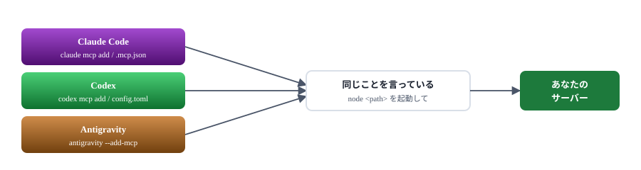
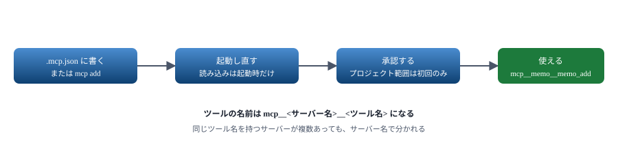
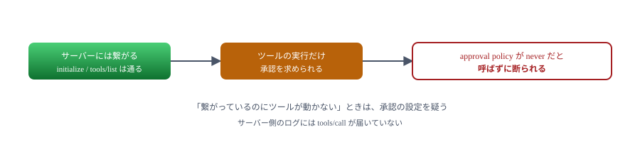
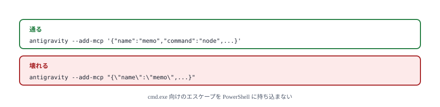
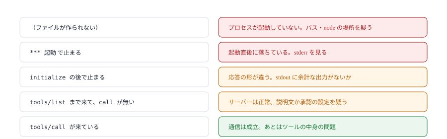

# 04. ホストに登録する

Claude Code・Codex・Antigravity へ登録し、実際に呼ばせる

> 📅 作成: 2026-09-07 / 更新: 2026-09-07

[03. SDK で書き直す](03-SDKで書き直す.md)

[目次](../README.md)

[05. 3 つの提供物](05-3つの提供物.md)

## この資料の内容

1. [登録するとは何をすることか](#1-登録するとは何をすることか)
2. [Claude Code](#2-claude-code)
3. [Codex](#3-codex)
4. [Antigravity](#4-antigravity)
5. [動かないときの切り分け](#5-動かないときの切り分け)

## 1. 登録するとは何をすることか

stdio のサーバーの登録は、要するに<strong>「このコマンドを起動してください」と伝えるだけ</strong>です。特別な仕組みはありません。

```json
{
	"command": "node",
	"args": ["docs/samples/03-sdk/server.mjs"]
}
```

ホストはこれを子プロセスとして起こし、標準入出力で話しかけます。**どのホストでも中身は同じ**で、書き方と置き場所だけが違います。



書き方は 3 通りだが、伝えている内容は同じ。サーバー側を作り分ける必要はない。

### 置き場所には範囲がある

| 範囲 | 効く先 | 使いどころ |
|---|---|---|
| プロジェクト | そのフォルダで作業するときだけ | チームで共有したい。**お勧め** |
| 利用者 | その人のすべての作業 | どこでも使う道具 |

> [!NOTE]
> <strong>まずプロジェクト範囲で試してください。</strong>設定がリポジトリの中に収まるので、消したいときはファイルを消すだけで済みます。利用者範囲に入れると、他のプロジェクトでも起動されるようになります。

## 2. Claude Code

### コマンドで登録する

```powershell
# プロジェクト範囲（.mcp.json に書かれる）
claude mcp add --scope project memo -- node docs/samples/06-memo/server.mjs

# 環境変数を渡す
claude mcp add memo -e MEMO_FILE=C:/data/memo.jsonl -- node server.mjs

# HTTP のサーバー
claude mcp add --transport http remote https://example.com/mcp
```

`--` より後ろが、そのまま起動するコマンドになります。**この区切りを忘れると、後ろの引数が `claude` のものとして読まれます**。

### ファイルに直接書く

プロジェクト範囲の実体は、リポジトリ直下の `.mcp.json` です。手で書いても同じです。

```json
{
	"mcpServers": {
		"memo": {
			"command": "node",
			"args": ["docs/samples/06-memo/server.mjs"]
		}
	}
}
```

### 確かめる

```powershell
claude mcp list        # 一覧と接続の可否
claude mcp get memo    # 1 本の詳細
claude mcp remove memo # 消す
```



設定を読むのは起動のときだけ。書き換えたら起動し直す。

> [!NOTE]
> <strong>プロジェクト範囲の `.mcp.json` は、初回に承認が要ります。</strong>他人のリポジトリを開いただけで勝手にプロセスが起動しないための仕組みです。承認していないサーバーは一覧に「⏸ Pending approval」と出て、接続されません。

## 3. Codex

### コマンドで登録する

```powershell
codex mcp add memo -- node docs/samples/06-memo/server.mjs

# HTTP のサーバー
codex mcp add remote --url https://example.com/mcp

# 環境変数
codex mcp add memo --env MEMO_FILE=C:/data/memo.jsonl -- node server.mjs
```

書かれる先は `~/.codex/config.toml` です。Claude Code と違い、**プロジェクト単位の設定ファイルはありません**。

### 設定を書き換えずに試す

`-c` でその場だけ上書きできます。**設定ファイルを汚さずに試せる**ので、動作確認に向きます。

```powershell
codex exec -c 'mcp_servers.memo={command="node", args=["docs/samples/06-memo/server.mjs"]}' "メモを検索して"
```

### 確かめる

```powershell
codex mcp list
codex mcp get memo
codex mcp remove memo
```



接続とツールの実行は別の関門。ログに `tools/call` が来ていなければ、サーバーの問題ではない。

## 4. Antigravity

Antigravity は VS Code をもとにしたエディタなので、登録の作法もそちら寄りです。

```powershell
antigravity --add-mcp '{"name":"memo","command":"node","args":["docs/samples/06-memo/server.mjs"]}'
```

JSON を 1 つの引数として渡します。**PowerShell では全体をシングルクォートで囲みます**。ダブルクォートで囲むと、中の `"` が壊れます。

> [!NOTE]
> <strong>エディタの設定画面からも登録できます。</strong>コマンドが使えない・引数の引用符で詰まる、というときは画面から入れるほうが確実です。GUI から入れても、書かれる先は同じです。



JSON を引数に渡すときは、外側をシングルクォートで囲むのが確実。

### 3 つの違いのまとめ

| 項目 | Claude Code | Codex | Antigravity |
|---|---|---|---|
| 登録コマンド | `claude mcp add` | `codex mcp add` | `--add-mcp` |
| プロジェクト単位 | ✅ **あり** `.mcp.json` | ❌ **なし** | ⚠️ **エディタ次第** |
| 一時的に試す | — | ✅ **あり** `-c` | — |
| 喋る版 | 2025-11-25 | 2025-06-18 | — |

> [!NOTE]
> <strong>「喋る版」は実測した値です。</strong>Claude Code 2.1.263 と Codex 0.153.4 で確かめました。版が上がれば変わります。自分の環境で確かめる方法は次の章にあります。

## 5. 動かないときの切り分け

「登録したのにツールが出てこない」。このとき最初にやるべきは、**どこまで届いているかを見ること**です。

### 観測用のサーバーを挟む

受け取った行をすべてファイルに書き出すサーバーを用意しておくと、一発で分かります。[samples/02-minimal/probe.mjs](samples/02-minimal/probe.mjs) がそれです。

```javascript
function record(direction, text) {
	const stamp = new Date().toISOString();
	appendFileSync(LOG, `${stamp} ${direction} ${text}\n`, 'utf8');
}
```

これを登録して呼ぶと、こう残ります。

```text
2026-09-07T09:43:33.182Z *** 起動 pid=22140
2026-09-07T09:43:33.335Z --> {"method":"initialize","params":{"protocolVersion":"2025-11-25",...}}
2026-09-07T09:43:33.337Z <-- {"jsonrpc":"2.0","id":0,"result":{...}}
2026-09-07T09:43:33.471Z --> {"jsonrpc":"2.0","method":"notifications/initialized"}
2026-09-07T09:43:33.546Z --> {"method":"tools/list","jsonrpc":"2.0","id":1}
2026-09-07T09:43:41.732Z --> {"method":"tools/call","params":{"name":"add",...}}
```



止まった位置が原因を教える。推測で設定をいじる前に、まずここを見る。

### よくある原因

| 症状 | 原因 | 直し方 |
|---|---|---|
| プロセスが起動しない | 相対パスの基準がずれている | 絶対パスにして確かめる。通ったら相対に戻す |
| 起動直後に落ちる | 依存が入っていない | 手で `node server.mjs` を動かしてエラーを見る |
| 繋がるがツールが出ない | `console.log` が混ざっている | [02 章](02-最小のサーバー.md)の「stdout を汚さない」 |
| ツールは出るが呼ばれない | 説明文が足りない | `description` に「いつ使うか」を書く |
| 呼ばれるが断られる | 承認の設定 | ホスト側の設定を見る。サーバーは無関係 |
| 設定を変えても反映されない | 読み込みは起動時だけ | ホストを起動し直す |

> [!NOTE]
> **手で動かせるものは、まず手で動かします。**`node server.mjs` と打って何も起きなければ（入力待ちになれば）正常です。エラーが出るなら、ホストに登録する前にそれを直します。ホストを経由すると、エラーメッセージが見えなくなります。

### 次の章へ

登録して呼べるようになりました。次は Tools 以外の 2 つ、Resources と Prompts を扱います。

[03. SDK で書き直す](03-SDKで書き直す.md)

[目次](../README.md)

[05. 3 つの提供物](05-3つの提供物.md)
