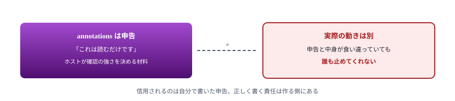
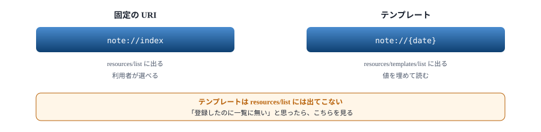
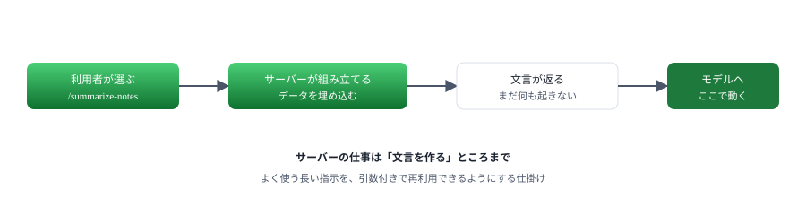
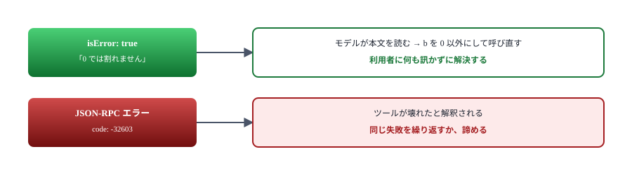
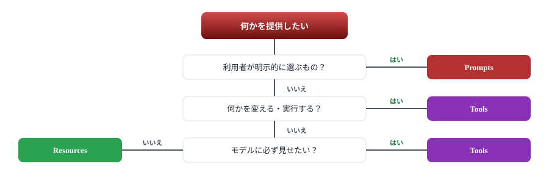

# 05. 3 つの提供物

Tools・Resources・Prompts の違いと、失敗の返し方

> 📅 作成: 2026-09-07 / 更新: 2026-09-07

[04. ホストに登録する](04-ホストに登録する.md)

[目次](../README.md)

[06. ハンズオン① メモサーバー](06-ハンズオン-メモサーバー.md)

## この資料の内容

1. [Tools — モデルが実行する](#1-tools--モデルが実行する)
2. [Resources — 読ませる](#2-resources--読ませる)
3. [Prompts — 利用者が選ぶ](#3-prompts--利用者が選ぶ)
4. [失敗の返し方](#4-失敗の返し方)
5. [どれにするか](#5-どれにするか)

## 1. Tools — モデルが実行する

ここまで扱ってきたものです。**モデルが判断して呼びます**。副作用があってよく、計算や書き換えを担います。

### 注釈で性質を伝える

`annotations` で、そのツールがどういう性質かをホストに伝えられます。

```javascript
server.registerTool(
	'build_run',
	{
		title: 'コマンドを実行する',
		description: '決めておいたコマンドを名前で指定して実行する',
		inputSchema: { name: z.string() },
		annotations: {
			// 読むだけではないこと・元に戻せることを伝える
			readOnlyHint: false,
			destructiveHint: false,
		},
	},
	async ({ name }) => { /* ... */ },
);
```

| 注釈 | 意味 | ホストの使い道 |
|---|---|---|
| `readOnlyHint` | 読むだけで何も変えない | 確認を省いてよいと判断できる |
| `destructiveHint` | 元に戻せない変更をする | 強く確認する |
| `idempotentHint` | 何度呼んでも結果が同じ | 失敗時に再実行してよい |
| `openWorldHint` | 外部のサービスに触る | ネットワークの利用を知らせる |



仕様も「注釈は信用できないものとして扱え」と書いている。使う側ではなく、作る側が正直に書く。

## 2. Resources — 読ませる

読むだけのデータです。**URI で指定して読みます**。ファイル・設定・一覧など、実行を伴わないものが向きます。

### 固定の URI を 1 つ

```javascript
server.registerResource(
	'notes-index',
	'note://index',
	{
		title: 'メモの一覧',
		description: '記録してある日付の一覧',
		mimeType: 'text/plain',
	},
	async (uri) => ({
		contents: [{ uri: uri.href, text: Object.keys(NOTES).join('\n') }],
	}),
);
```

### URI に変数を入れる

`ResourceTemplate` を使うと `note://2026-09-05` のような形で受けられます。

```javascript
import { ResourceTemplate } from '@modelcontextprotocol/sdk/server/mcp.js';

server.registerResource(
	'note',
	new ResourceTemplate('note://{date}', { list: undefined }),
	{ title: 'メモ', description: '日付を指定してメモを読む', mimeType: 'text/plain' },
	async (uri, { date }) => ({
		contents: [{ uri: uri.href, text: NOTES[date] ?? `${date} のメモはありません` }],
	}),
);
```

読むとこうなります。

```json
{"result":{"contents":[{"uri":"note://2026-09-05","text":"MCP の調査を始めた"}]},"jsonrpc":"2.0","id":3}
```



2 つの一覧は別。テンプレートを普通の一覧に出したい場合は `list` に関数を渡す。

> [!NOTE]
> <strong>Resources を読むかどうかはホスト次第です。</strong>Tools はモデルが自分で呼びますが、Resources は「利用者が選んで文脈に入れる」作りのホストが多く、モデルが勝手に読むとは限りません。**モデルに必ず見せたいものは Tools にする**のが確実です。

## 3. Prompts — 利用者が選ぶ

定型の指示を組み立てて返します。**実行はしません**。返すのは「モデルに送る文言」です。

```javascript
server.registerPrompt(
	'summarize-notes',
	{
		title: 'メモをまとめる',
		description: '記録してあるメモを短くまとめさせる',
		argsSchema: { style: z.enum(['箇条書き', '文章']).describe('まとめ方') },
	},
	({ style }) => ({
		messages: [
			{
				role: 'user',
				content: {
					type: 'text',
					text: `次のメモを${style}でまとめてください。\n\n`
						+ Object.entries(NOTES).map(([d, t]) => `${d}: ${t}`).join('\n'),
				},
			},
		],
	}),
);
```

返るのはこれです。モデルに渡す前の、文言そのものです。

```json
{
  "messages": [
    {
      "role": "user",
      "content": {
        "type": "text",
        "text": "次のメモを箇条書きでまとめてください。\n\n2026-09-01: 打ち合わせ。次の版は 10 月\n2026-09-05: MCP の調査を始めた"
      }
    }
  ]
}
```



Prompts はテンプレート。モデルを呼ぶのはホストの役目。

## 4. 失敗の返し方

MCP には失敗の返し方が 2 通りあります。**使い分けを間違えると、モデルが自力で直せなくなります**。

| 返し方 | 使う場面 | モデルから見ると |
|---|---|---|
| `isError: true` | ツールは動いたが、結果が思わしくない | 本文が読める。**直して呼び直せる** |
| JSON-RPC エラー | そもそも呼べない（知らないツール名など） | 失敗としか分からない |

```javascript
async ({ a, b }) => {
	// 失敗はプロトコルのエラーではなく、結果の isError で返す。
	// そうするとモデルが読んで直せる
	if (b === 0) {
		return {
			content: [{ type: 'text', text: '0 では割れません' }],
			isError: true,
		};
	}
	return { content: [{ type: 'text', text: String(a / b) }] };
}
```



「呼び方を直せば済む失敗」は必ず `isError` で返す。理由を本文に書けば、モデルはそれを読む。

> [!NOTE]
> **本文に「どう直せばよいか」を書きます。**「失敗しました」だけでは直しようがありません。「a と b には数値を渡してください」「使えるのは test / version / slow です」のように、次に何をすべきかまで書きます。

## 5. どれにするか



迷ったら Tools にしておけば動く。Resources と Prompts は、後から足せる。

### 両方で出してよい

同じデータを Resources と Tools の両方で出すのは、おかしなことではありません。[次の章](06-ハンズオン-メモサーバー.md)で作るメモサーバーは、まさにそうしています。

| 出し方 | 名前 | 誰のためか |
|---|---|---|
| Resources | `memo://all` | 利用者が全体を見たいとき |
| Tools | `memo_search` | モデルが条件で絞りたいとき |

> [!NOTE]
> <strong>数を絞ることも設計です。</strong>ツールを 30 個並べると、モデルはどれを使うか迷います。「よく使う 3 つ」に絞り、残りは 1 つのツールの引数で分ける、という手もあります。**並べれば使われるわけではありません。**

### 次の章へ

材料は揃いました。次は実際に手を動かして、メモを記録・検索するサーバーを作りきります。

[04. ホストに登録する](04-ホストに登録する.md)

[目次](../README.md)

[06. ハンズオン① メモサーバー](06-ハンズオン-メモサーバー.md)
