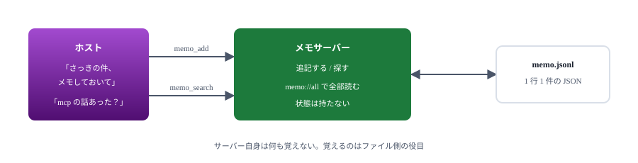
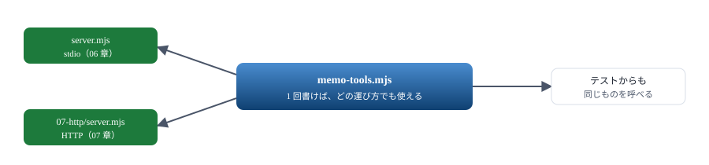
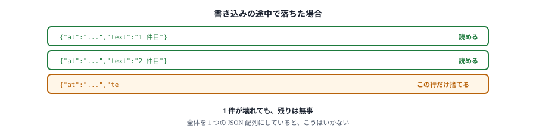
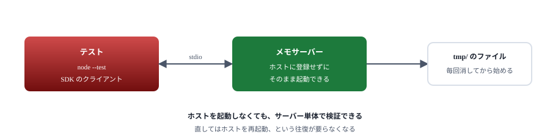

# 06. ハンズオン① メモサーバー

メモを記録・検索するサーバーを、動くところまで作りきる

> 📅 作成: 2026-09-07 / 更新: 2026-09-07

[05. 3 つの提供物](05-3つの提供物.md)

[目次](../README.md)

[07. HTTP に載せ替える](07-HTTPに載せ替える.md)

## この資料の内容

1. [何を作るか](#1-何を作るか)
2. [中身と運び方を分ける](#2-中身と運び方を分ける)
3. [記録する](#3-記録する)
4. [探す](#4-探す)
5. [確かめる](#5-確かめる)

## 1. 何を作るか

思いついたことを記録し、あとから探せるサーバーです。外部のサービスに繋がないので、ネットワークが無くても動きます。

| 出すもの | 名前 | すること |
|---|---|---|
| Tool | `memo_add` | 本文と札を受け取って 1 件記録する |
| Tool | `memo_search` | 語を含むメモを探す |
| Resource | `memo://all` | 全部読む |



状態をファイルに持たせておくと、07 章でそのまま HTTP に載せ替えられる。

### 保存の形

1 行 1 件の JSON（JSONL）にします。追記が `appendFile` だけで済み、途中で落ちても壊れた行を読み飛ばせます。

```text
{"at":"2026-09-07T09:51:42.075Z","text":"MCP の資料を書き始めた","tags":["mcp","資料"]}
{"at":"2026-09-07T09:51:42.078Z","text":"stdio と HTTP の違いを整理","tags":[]}
```

## 2. 中身と運び方を分ける

ファイルを 2 つに分けます。**これが後で効きます**。

| ファイル | 役割 |
|---|---|
| `memo-tools.mjs` | ツールと Resource の中身。トランスポートには触れない |
| `server.mjs` | stdio に繋ぐだけ。7 行 |

```javascript
// server.mjs はこれだけ
import { StdioServerTransport } from '@modelcontextprotocol/sdk/server/stdio.js';
import { createMemoServer } from './memo-tools.mjs';

await createMemoServer().connect(new StdioServerTransport());
```

`memo-tools.mjs` 側は、サーバーを組み立てて返す関数にします。

```javascript
export function createMemoServer() {
	const server = new McpServer({ name: 'memo', version: '1.0.0' });

	server.registerTool('memo_add', { /* ... */ }, async ({ text, tags }) => { /* ... */ });
	server.registerTool('memo_search', { /* ... */ }, async ({ query, limit }) => { /* ... */ });
	server.registerResource('memo-all', 'memo://all', { /* ... */ }, async (uri) => { /* ... */ });

	return server;
}
```



ツールの中身とトランスポートを混ぜて書くと、07 章で全部書き直すことになる。

### 保存先を差し替えられるようにする

```javascript
const FILE = process.env.MEMO_FILE
	?? join(dirname(fileURLToPath(import.meta.url)), 'memo.jsonl');
```

> [!NOTE]
> <strong>置き場所は必ず環境変数で変えられるようにします。</strong>テストのたびに本物のメモが汚れては困ります。既定値を持たせつつ、外から差し替えられる形にしておくのが基本です。

## 3. 記録する

```javascript
server.registerTool(
	'memo_add',
	{
		title: 'メモを足す',
		description: 'メモを 1 件記録する',
		inputSchema: {
			text: z.string().min(1).describe('記録する内容'),
			tags: z.array(z.string()).optional().describe('分類のための札'),
		},
	},
	async ({ text, tags }) => {
		const entry = { at: new Date().toISOString(), text, tags: tags ?? [] };
		await appendFile(FILE, JSON.stringify(entry) + '\n', 'utf8');
		return { content: [{ type: 'text', text: `記録した: ${entry.at}` }] };
	},
);
```

### 読み込みは壊れに強くする

```javascript
// 1 行 1 件の JSON。壊れた行は読み飛ばす
async function load() {
	try {
		const text = await readFile(FILE, 'utf8');
		return text.split('\n')
			.filter((line) => line.trim())
			.map((line) => { try { return JSON.parse(line); } catch { return null; } })
			.filter(Boolean);
	} catch (err) {
		if (err.code === 'ENOENT') return [];
		throw err;
	}
}
```



追記型の形式を選ぶ理由。1 つの大きな JSON にすると、途中で落ちた瞬間に全件を失う。

## 4. 探す

```javascript
server.registerTool(
	'memo_search',
	{
		title: 'メモを探す',
		description: '本文か札に語を含むメモを探す',
		inputSchema: {
			query: z.string().describe('探す語'),
			limit: z.number().int().min(1).max(50).default(10).describe('返す件数の上限'),
		},
	},
	async ({ query, limit }) => {
		const all = await load();
		const q = query.toLowerCase();
		const hit = all.filter((m) =>
			m.text.toLowerCase().includes(q) || m.tags.some((t) => t.toLowerCase().includes(q)));

		if (hit.length === 0) {
			return { content: [{ type: 'text', text: `「${query}」を含むメモはありません` }] };
		}

		// 新しいものから返す
		const lines = hit.slice(-limit).reverse()
			.map((m) => `${m.at} ${m.text}${m.tags.length ? ` [${m.tags.join(' ')}]` : ''}`);
		return {
			content: [{ type: 'text', text: `${hit.length} 件のうち ${lines.length} 件\n${lines.join('\n')}` }],
		};
	},
);
```

### 返し方に気を配る

| やっていること | 理由 |
|---|---|
| 0 件でも `isError` にしない | 探して無かったのは失敗ではない。「ありません」と伝えれば足りる |
| 件数を先に書く | 「120 件のうち 10 件」と分かれば、モデルは絞り込みを提案できる |
| `limit` に上限を付ける | 全件を返すと会話が埋まる。`max(50)` で歯止めをかける |
| 新しいものから返す | 直近の話題を探していることが多い |


返す量を決めるのはサーバー側の責任。ホストは受け取ったものをそのまま渡す。

## 5. 確かめる

### 手で叩く

```powershell
$env:MEMO_FILE = "./memo-test.jsonl"
@(
'{"jsonrpc":"2.0","id":1,"method":"initialize","params":{"protocolVersion":"2025-11-25","capabilities":{},"clientInfo":{"name":"手","version":"1.0"}}}'
'{"jsonrpc":"2.0","method":"notifications/initialized"}'
'{"jsonrpc":"2.0","id":2,"method":"tools/call","params":{"name":"memo_add","arguments":{"text":"MCP の資料を書き始めた","tags":["mcp"]}}}'
) -join "`n" | node server.mjs
```

> [!NOTE]
> <strong>手で流し込むと、順番どおりに処理されるとは限りません。</strong>実際にやってみると、後から送った検索が先に返ってくることがあります。サーバーは受け取った順に**並行して**処理し、終わった順に返すためです。`id` で対応が取れているので問題はありませんが、「追記してから探す」ような確認には向きません。

### テストを書く

順番が要る確認には、応答を待てるクライアントを使います。SDK にはクライアント側も入っています。

```javascript
import { Client } from '@modelcontextprotocol/sdk/client/index.js';
import { StdioClientTransport } from '@modelcontextprotocol/sdk/client/stdio.js';

const transport = new StdioClientTransport({
	command: process.execPath,
	args: [serverPath],
	// 環境変数を渡さないと既定の PATH すら無くなる
	env: { ...process.env, MEMO_FILE: '...' },
	stderr: 'ignore',
});

const client = new Client({ name: 'tests', version: '1.0.0' }, { capabilities: {} });
await client.connect(transport);
```

これを使ったテストです。

```javascript
test('書いたメモは探せる。札でも探せる', async () => {
	await rm(STDIO_FILE, { force: true });
	const client = await connect(sample('06-memo/server.mjs'), { env: { MEMO_FILE: STDIO_FILE } });

	try {
		await client.callTool({
			name: 'memo_add',
			arguments: { text: 'stdio と HTTP の違いを整理した', tags: ['mcp'] },
		});

		// 本文で探す
		const byText = await client.callTool({ name: 'memo_search', arguments: { query: 'stdio' } });
		assert.match(textOf(byText), /1 件のうち 1 件/);

		// 無いものは無いと返す（例外にしない）
		const none = await client.callTool({ name: 'memo_search', arguments: { query: 'ない語' } });
		assert.match(textOf(none), /ありません/);
	} finally {
		await client.close();
	}
});
```

```text
✔ 何も書いていなければ、その旨を返す (980.9083ms)
✔ 書いたメモは探せる。札でも探せる (357.8825ms)
✔ 何度実行しても同じ結果になる（前の実行が残らない） (699.2658ms)
```



ホストを介さずに確かめられる。これがあると開発が速くなる。

### ホストに登録して使う

```json
{
	"mcpServers": {
		"memo": {
			"command": "node",
			"args": ["docs/samples/06-memo/server.mjs"]
		}
	}
}
```

登録して起動し直すと、「今日やったことをメモして」「先週 mcp の話をした記録ある？」が通るようになります。

### 次の章へ

このサーバーを、次の章で HTTP に載せ替えます。**`memo-tools.mjs` は 1 文字も変えません。**

[05. 3 つの提供物](05-3つの提供物.md)

[目次](../README.md)

[07. HTTP に載せ替える](07-HTTPに載せ替える.md)
