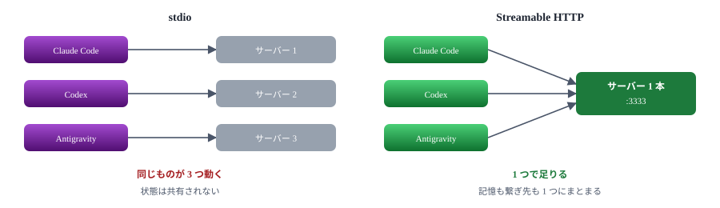
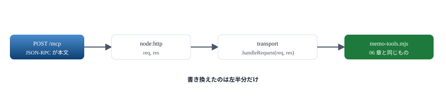
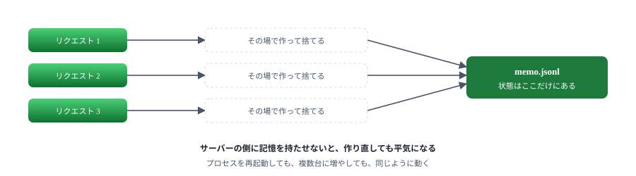
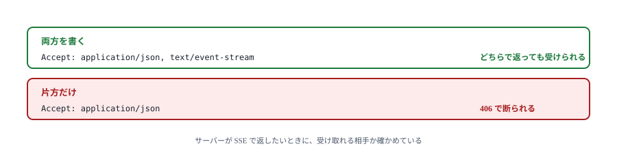
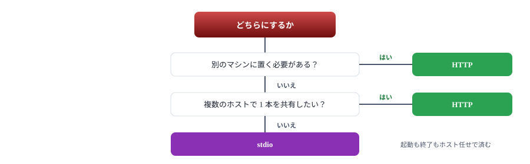

# 07. HTTP に載せ替える

同じサーバーを Streamable HTTP で動かす

> 📅 作成: 2026-09-07 / 更新: 2026-10-09

[06. ハンズオン① メモサーバー](06-ハンズオン-メモサーバー.md)

[目次](../README.md)

[08. 通知で伝える](08-通知で伝える.md)

## この資料の内容

1. [何が変わるか](#1-何が変わるか)
2. [載せ替える](#2-載せ替える)
3. [セッションを持つか](#3-セッションを持つか)
4. [動かす](#4-動かす)
5. [どちらを選ぶか](#5-どちらを選ぶか)

## 1. 何が変わるか

ツールの中身は変わりません。変わるのは**誰がプロセスを起こすか**です。

| 項目 | stdio | Streamable HTTP |
|---|---|---|
| 起動する人 | ホスト（子プロセスとして） | 自分（先に立てておく） |
| 寿命 | ホストと一緒に終わる | 止めるまで生きている |
| 共有 | ホストごとに 1 本ずつ立つ | **1 本を何人でも使える** |
| 置き場所 | 同じ PC のみ | 別のマシンでもよい |
| `console.log` | ❌ **禁止** | ✅ **使える** |
| 手間 | 登録するだけ | 起動と終了を自分で見る |



3 つのホストから使うなら、プロセスの数が 3 対 1 になる。[10 章](10-プロセス共有.md)で詳しく扱う。

## 2. 載せ替える

[samples/07-http/server.mjs](samples/07-http/server.mjs) の全文です。**`memo-tools.mjs` はそのまま使います**。

```javascript
import { createServer } from 'node:http';
import { parseArgs } from 'node:util';
import { StreamableHTTPServerTransport } from '@modelcontextprotocol/sdk/server/streamableHttp.js';
import { createMemoServer } from '../06-memo/memo-tools.mjs';

const { values } = parseArgs({ options: { port: { type: 'string', default: '3333' } } });
const PORT = Number(values.port);

// プロセス一覧のウィンドウタイトルにもポートを出す
process.title = `memo-http:${PORT}`;

const http = createServer(async (req, res) => {
	// MCP のエンドポイントは 1 つ。ここに POST が来る
	if (!req.url?.startsWith('/mcp')) {
		res.writeHead(404, { 'content-type': 'text/plain; charset=utf-8' });
		res.end('/mcp へ POST してください\n');
		return;
	}

	// セッションを持たない形。リクエストごとに使い捨てる
	const server = createMemoServer();
	const transport = new StreamableHTTPServerTransport({ sessionIdGenerator: undefined });

	// 応答が終わったら片付ける。閉じ忘れると接続が溜まる
	res.on('close', () => {
		transport.close();
		server.close();
	});

	try {
		await server.connect(transport);
		await transport.handleRequest(req, res);
	} catch (err) {
		console.error('[http] 失敗:', err);
		if (!res.headersSent) {
			res.writeHead(500, { 'content-type': 'application/json' });
			res.end(JSON.stringify({
				jsonrpc: '2.0',
				error: { code: -32603, message: 'Internal server error' },
				id: null,
			}));
		}
	}
});

http.listen(PORT, () => {
	// stdio 版と違い、標準出力に書いても壊れない
	console.log(`メモサーバー（HTTP）: http://localhost:${PORT}/mcp`);
});
```

> [!NOTE]
> <strong>Web のフレームワークは要りません。</strong>Node の `node:http` だけで足ります。`transport.handleRequest(req, res)` に投げれば、あとは SDK が処理します。



トランスポートを差し替えるだけで済むのは、06 章で中身を分けておいたおかげ。

## 3. セッションを持つか

`sessionIdGenerator` をどうするかで、2 つの作りに分かれます。

| 書き方 | ふるまい | 向くもの |
|---|---|---|
| `undefined` | セッションを持たない。1 回のリクエストで完結する | 状態をファイルや DB に持つサーバー |
| `() => randomUUID()` | セッション ID を発行し、記憶の中に状態を持つ | 接続ごとの状態が要るサーバー |

メモサーバーは**持たない側**にしました。状態はファイルにあるので、リクエストごとに作り直しても困りません。



状態を外に出しておくのは、共有や再起動を考えると効いてくる。

> [!NOTE]
> **後片付けを忘れないでください。**`res.on('close', ...)` で `transport.close()` と `server.close()` を呼びます。リクエストごとに作るのに閉じないと、使われないオブジェクトが溜まり続けます。

## 4. 動かす

```powershell
node docs/samples/07-http/server.mjs --port 3333
```

```text
メモサーバー（HTTP）: http://localhost:3333/mcp
```

ポートは**環境変数ではなく引数**で渡します。常駐させると、同じサーバーを本番用・試験用と複数立てることがあります。引数ならプロセス一覧（`tasklist` やタスクマネージャー）のコマンドラインに出るので、どれがどのポートかを見分けて止められます。環境変数は一覧に出ません。

### 叩いてみる

```powershell
$body = '{"jsonrpc":"2.0","id":1,"method":"initialize","params":{"protocolVersion":"2025-11-25","capabilities":{},"clientInfo":{"name":"手","version":"1.0"}}}'

Invoke-WebRequest -Uri http://localhost:3333/mcp -Method Post `
	-Body $body -ContentType 'application/json' `
	-Headers @{ Accept = 'application/json, text/event-stream' } -UseBasicParsing
```

返ってきたものです。

```text
HTTP 200
event: message
data: {"result":{"protocolVersion":"2025-11-25","capabilities":{...},"serverInfo":{"name":"memo","version":"1.0.0"}},"jsonrpc":"2.0","id":1}
```

### Accept ヘッダを忘れない

<strong>これが最初の関門です。</strong>応答は「ただの JSON」か「SSE のストリーム」のどちらかで返ります。**両方を受け取れると伝えないと、サーバーは断ります**。

```text
Accept: application/json, text/event-stream
```



curl や fetch を手で書くときの引っかかりどころ。SDK のクライアントを使えば自動で付く。

### SSE の形

SSE で返る場合、本文はこうなります。`data:` の後ろが JSON-RPC のメッセージです。

```text
event: message
data: {"result":{...},"jsonrpc":"2.0","id":1}
```

手で解く場合はこう取り出します（[10 章](10-プロセス共有.md)のブリッジで使います）。

```javascript
function extractMessages(contentType, body) {
	if (contentType.includes('text/event-stream')) {
		return body.split('\n')
			.filter((line) => line.startsWith('data:'))
			.map((line) => line.slice(5).trim())
			.filter(Boolean);
	}
	return body.trim() ? [body.trim()] : [];
}
```

### ホストに登録する

```powershell
claude mcp add --transport http memo http://localhost:3333/mcp
codex mcp add memo --url http://localhost:3333/mcp
```

## 5. どちらを選ぶか



迷ったら stdio。共有したくなってから HTTP に移せばよい。中身は変えずに済む。

### HTTP を選んだときに増える仕事

| 増えること | 対処 |
|---|---|
| 起動と終了 | 常駐させる仕掛けが要る（サービス登録など） |
| ポートの管理 | 他と重ならない番号を決める |
| 落ちたときの検知 | ホストからは「繋がらない」としか見えない |
| 誰でも繋げる | 同じ PC の他のプログラムからも叩ける。`127.0.0.1` に限定する |

> [!NOTE]
> <strong>外に出すなら認証が要ります。</strong>この資料の例は `localhost` の中だけで使う前提です。ネットワークに出す場合は、MCP の認可（OAuth）が別に決まっています。<strong>認証なしのサーバーを社内ネットワークに置かないでください。</strong>ツールは実行される側であり、誰でも叩ける状態は危険です。

### 次の章へ

ここまでは「訊かれたら答える」だけでした。次は**サーバーの側から伝える**方法と、その限界を扱います。

[06. ハンズオン① メモサーバー](06-ハンズオン-メモサーバー.md)

[目次](../README.md)

[08. 通知で伝える](08-通知で伝える.md)
