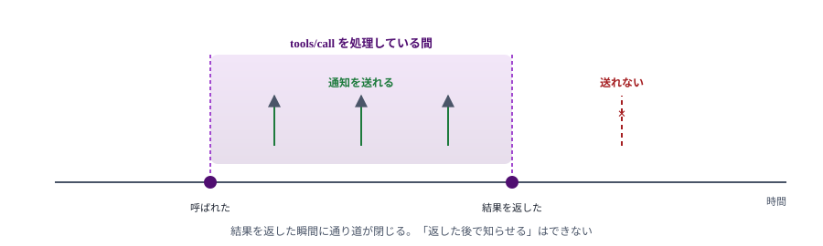
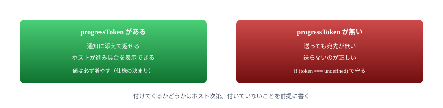
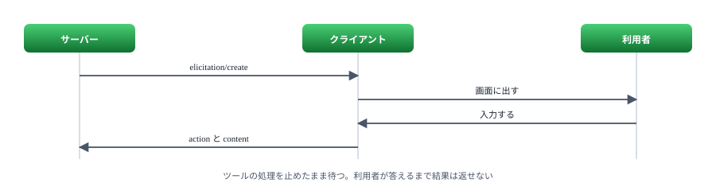
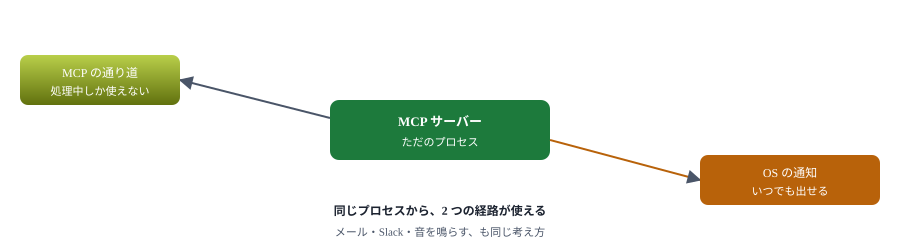
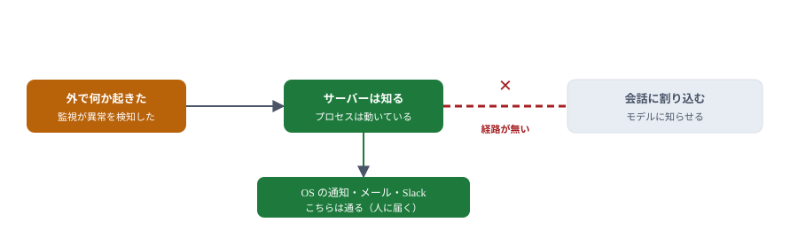

# 08. 通知で伝える

処理の結果をサーバーから伝える方法と、その限界

> 📅 作成: 2026-09-07 / 更新: 2026-09-07

[07. HTTP に載せ替える](07-HTTPに載せ替える.md)

[目次](../README.md)

[09. タスク](09-タスク.md)

## この資料の内容

1. [できることとできないこと](#1-できることとできないこと)
2. [進捗を知らせる](#2-進捗を知らせる)
3. [利用者に尋ねる](#3-利用者に尋ねる)
4. [画面に出す（枠の外）](#4-画面に出す枠の外)
5. [呼ばれていないときは届かない](#5-呼ばれていないときは届かない)

## 1. できることとできないこと

「処理が終わったら知らせたい」。よくある要望ですが、MCP では**できることとできないことがはっきり分かれます**。先に線を引いておきます。

| やりたいこと | 手立て | 可否 |
|---|---|---|
| 処理の途中経過を伝えたい | `notifications/progress` | ✅ **できる** |
| 途中で利用者に尋ねたい | `elicitation/create` | ✅ **できる** |
| 人に確実に気づかせたい | OS の通知（MCP の外） | ✅ **できる** |
| 長い処理を投げて後で結果を取りたい | タスク（[09 章](09-タスク.md)） | ⚠ **相手次第** |
| 何も呼ばれていないのに割り込みたい | — | ❌ **できない** |



通知には流し込む先が要る。その先はリクエストの処理中だけ開いている。

> [!NOTE]
> <strong>なぜこうなっているのか。</strong>仕様には `Servers MUST NOT initiate JSON-RPC requests` と書かれています。やりとりを始めるのは常にクライアント側で、サーバーは応答と通知だけを返します。[01 章](01-背景.md)で触れた非対称が、ここで効いてきます。

## 2. 進捗を知らせる

ホストが `_meta.progressToken` を付けて呼んできたとき、**そのときだけ**進捗を送れます。

### 実際に届くもの

Claude Code から `tools/call` が来たときの中身です。

```json
{
  "method": "tools/call",
  "params": {
    "name": "add",
    "arguments": { "a": 2, "b": 3 },
    "_meta": {
      "claudecode/toolUseId": "toolu_018tCHaryTHbnYbduhcYUqZW",
      "progressToken": 2
    }
  },
  "jsonrpc": "2.0",
  "id": 2
}
```

`progressToken: 2` が付いています。これを添えて通知を返します。

### 送る

```javascript
server.registerTool(
	'countdown',
	{
		title: '数える',
		description: '指定した秒数を数え、その間に進捗を知らせる',
		inputSchema: { seconds: z.number().int().min(1).max(10).default(3) },
	},
	async ({ seconds }, extra) => {
		const token = extra._meta?.progressToken;

		for (let i = 1; i <= seconds; i++) {
			await sleep(1000);
			if (token === undefined) continue;
			await extra.sendNotification({
				method: 'notifications/progress',
				params: { progressToken: token, progress: i, total: seconds, message: `${i}/${seconds} 秒` },
			});
		}

		return { content: [{ type: 'text', text: `${seconds} 秒数えた` }] };
	},
);
```

流れる通知です。

```json
{"method":"notifications/progress","params":{"progressToken":"t1","progress":1,"total":2,"message":"1/2 秒"},"jsonrpc":"2.0"}
{"method":"notifications/progress","params":{"progressToken":"t1","progress":2,"total":2,"message":"2/2 秒"},"jsonrpc":"2.0"}
```



トークンの有無を必ず確かめる。無いのに送るのは、宛名の無い手紙を出すのと同じ。

> [!NOTE]
> <strong>進捗の値は必ず増やします。</strong>仕様に「`progress` の値は毎回増えなければならない」と書かれています。総数が分からないときは `total` を省き、`progress` だけを 1, 2, 3… と増やします。

## 3. 利用者に尋ねる

サーバーからリクエストは送れない、と書きました。**ただし例外があります**。クライアントが「尋ねられる用意がある」と名乗っている場合です。

### 相手が名乗っているか確かめる

Claude Code は `initialize` でこう名乗ってきます。

```json
"capabilities": { "roots": { "listChanged": true }, "elicitation": {} }
```

`elicitation` があるので、尋ねられます。

### 尋ねる

```javascript
const answer = await extra.sendRequest(
	{
		method: 'elicitation/create',
		params: {
			mode: 'form',
			message: 'お名前を教えてください',
			requestedSchema: {
				type: 'object',
				properties: { name: { type: 'string', title: '名前' } },
				required: ['name'],
			},
		},
	},
	z.object({ action: z.string(), content: z.record(z.string(), z.unknown()).optional() }),
);

if (answer.action !== 'accept') {
	return { content: [{ type: 'text', text: `尋ねたが ${answer.action} だった` }] };
}
return { content: [{ type: 'text', text: `こんにちは、${answer.content?.name} さん` }] };
```

### 3 つの返事

| action | 意味 | やること |
|---|---|---|
| `accept` | 答えてくれた | `content` を使う |
| `decline` | はっきり断られた | 別の手を出す |
| `cancel` | 閉じられた・答えられなかった | 後でまた尋ねてよい |



ツールの中から利用者に問いかけられる。ただし待たせることになるので、多用しない。

### 実測

対話していない状態（`claude -p` での実行）で呼ぶと、こう返ります。

```text
elicitation の答え: {"action":"cancel"}
```

画面に出せる相手がいないので `cancel` です。**断られる前提で書いておく**必要があります。

> [!NOTE]
> <strong>パスワードや API キーを form で尋ねてはいけません。</strong>仕様で禁じられています。入力した値がクライアント側を通るためです。そうした情報が要る場合は、URL を開いてもらう `mode: 'url'` を使います。

## 4. 画面に出す（枠の外）

「ビルドが終わったら気づきたい」。この要望に**最も確実に応えるのは、MCP の外側**です。サーバーは普通のプロセスなので、OS の通知を出せます。

```javascript
await execFileAsync('powershell', [
	'-NoProfile', '-ExecutionPolicy', 'Bypass',
	'-File', join(HERE, 'toast.ps1'),
	'-Title', title, '-Message', message,
]);
```

呼ばれる `toast.ps1` の中身です。

```powershell
[void][Windows.UI.Notifications.ToastNotificationManager, Windows.UI.Notifications, ContentType = WindowsRuntime]

$xml = [Windows.UI.Notifications.ToastNotificationManager]::GetTemplateContent(
	[Windows.UI.Notifications.ToastTemplateType]::ToastText02)

$texts = $xml.GetElementsByTagName('text')
[void]$texts.Item(0).AppendChild($xml.CreateTextNode($Title))
[void]$texts.Item(1).AppendChild($xml.CreateTextNode($Message))

# 送り主として登録済みのアプリ ID が要る。PowerShell のものを借りる
$appId = '{1AC14E77-02E7-4E5D-B744-2EB1AE5198B7}\WindowsPowerShell\v1.0\powershell.exe'

$notifier = [Windows.UI.Notifications.ToastNotificationManager]::CreateToastNotifier($appId)
$notifier.Show([Windows.UI.Notifications.ToastNotification]::new($xml))
```

> [!NOTE]
> <strong>Windows PowerShell 5.1 で呼びます。</strong>pwsh 7 で同じことをすると `Unable to find type [Windows.UI.Notifications.ToastNotificationManager...]` になります。WinRT の型が読み込まれないためです。`powershell`（5.1）を明示して呼んでください。



MCP の中で解こうとすると詰まる要望も、外から見れば普通のプロセスなので手がある。

> [!NOTE]
> <strong>AI に伝えるのと、人に伝えるのは別です。</strong>OS の通知は**人**に届きますが、モデルは知りません。モデルにも伝えたいなら、次にツールが呼ばれたときに「前回の処理は終わっています」と返す形が確実です。

## 5. 呼ばれていないときは届かない

最後に、はっきり線を引きます。

> [!NOTE]
> <strong>誰も何も呼んでいないときに、サーバーから会話へ割り込むことはできません。</strong>これは実装の都合ではなく、仕様がそう決めています。通知には流し込む先が要り、その先はクライアントが開いたときにしか存在しません。



横に抜ける道はある。真っ直ぐ会話に入る道が無い。

### 実際にはこう作る

| やりたいこと | 作り方 |
|---|---|
| ビルドの完了を知りたい | ツールの中で最後まで待ち、進捗を送る。終わったら OS の通知も出す |
| 長すぎて待てない | タスクにする（[09 章](09-タスク.md)）。ただし相手の対応が要る |
| 溜まったものを伝えたい | サーバー側に溜めておき、**次に呼ばれたとき**に結果へ添える |
| 今すぐ人に気づかせたい | OS の通知。MCP の外 |

> [!NOTE]
> <strong>「次に呼ばれたときに伝える」は地味ですが確実です。</strong>サーバー側に未読の知らせを溜めておき、どのツールが呼ばれても結果の末尾に「※ 3 件の完了があります」と付ける。どのホストでも動き、対応状況にも左右されません。

### 次の章へ

「長い処理を投げて、後から結果を取る」仕組みが仕様にあります。次の章で作りますが、**手元の Claude Code では使われませんでした**。その実測も含めて扱います。

[07. HTTP に載せ替える](07-HTTPに載せ替える.md)

[目次](../README.md)

[09. タスク](09-タスク.md)
