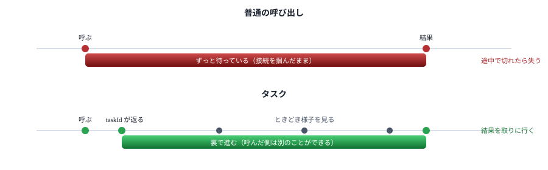
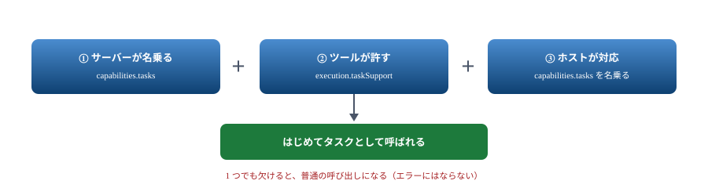
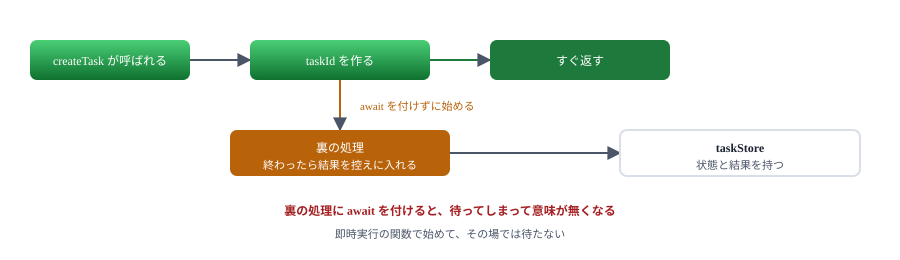
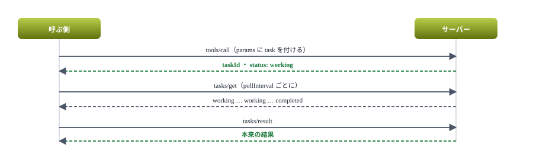
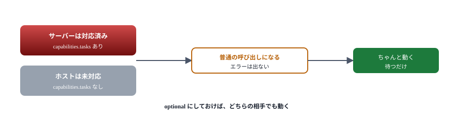

# 09. タスク

長い処理を投げて、あとから結果を取りに行く

> 📅 作成: 2026-09-07 / 更新: 2026-09-07

[08. 通知で伝える](08-通知で伝える.md)

[目次](../README.md)

[10. プロセス共有](10-プロセス共有.md)

## この資料の内容

1. [待たせないための仕組み](#1-待たせないための仕組み)
2. [名乗る](#2-名乗る)
3. [受け取って裏で進める](#3-受け取って裏で進める)
4. [取りに行く](#4-取りに行く)
5. [手元では使われなかった](#5-手元では使われなかった)

## 1. 待たせないための仕組み

ツールの中で 30 分かかる処理をすると、その間ずっと接続を掴んだままになります。途中で切れれば結果は失われます。

**タスク**は、この状況のためにあります。サーバーは受け付けた印（`taskId`）だけをすぐ返し、処理は裏で進めます。呼んだ側は好きなときに様子を見に来ます。



タスクは「引換券」を先に渡す仕組み。券があれば、あとから何度でも取りに行ける。

### 状態は 5 つ

| 状態 | 意味 |
|---|---|
| `working` | 処理中。最初は必ずこれ |
| `input_required` | 続けるのに入力が要る |
| `completed` | 終わった。結果がある |
| `failed` | 失敗した |
| `cancelled` | 取り消された |

下 3 つは**そこで止まり**、もう変わりません。

> [!NOTE]
> <strong>この仕組みは 2025-11-25 で入った新しいものです。</strong>仕様自身が「experimental（実験的）」と書いており、SDK でも `server.experimental.tasks` という置き場になっています。**将来変わる前提**で扱ってください。

## 2. 名乗る

タスクは**両者が対応していて初めて使えます**。名乗りは 2 段階あります。

### 1. サーバー全体として

```javascript
const server = new McpServer(
	{ name: 'tasks', version: '1.0.0' },
	{
		taskStore,
		// タスクに対応していることを名乗る。これを書かないとホストは task を付けてこない
		capabilities: {
			tasks: {
				list: {},
				cancel: {},
				requests: { tools: { call: {} } },
			},
		},
	},
);
```

> [!NOTE]
> <strong>これを書き忘れると `Server does not support task creation` で断られます。</strong>他の機能と違い、`registerToolTask` を呼んでも `capabilities` は自動で付きません。実際にこれで一度詰まりました。

### 2. ツール 1 つずつ

```javascript
execution: { taskSupport: 'optional' }
```

| 値 | 意味 |
|---|---|
| `forbidden` | タスクにできない。**既定** |
| `optional` | どちらでもよい。ホストが選ぶ |
| `required` | 必ずタスクにする。普通に呼ばれたら断る |



静かに普通の呼び出しに落ちるので、「タスクにしたつもりが違った」に気づきにくい。

## 3. 受け取って裏で進める

SDK の `registerToolTask` を使います。[samples/09-tasks/server.mjs](samples/09-tasks/server.mjs) の中心部です。

```javascript
import { InMemoryTaskStore } from '@modelcontextprotocol/sdk/experimental/tasks/stores/in-memory.js';

// タスクの状態をどこに置くか。ここでは記憶の中（再起動で消える）
const taskStore = new InMemoryTaskStore();

server.experimental.tasks.registerToolTask(
	'long_job',
	{
		title: '長い処理',
		description: '指定した秒数だけかかる処理。タスクとして実行できる',
		inputSchema: { seconds: z.number().int().min(1).max(60).default(5) },
		execution: { taskSupport: 'optional' },
	},
	{
		// 受け付けた時点で呼ばれる。すぐ返し、処理は裏で進める
		createTask: async ({ seconds }, extra) => {
			const task = await extra.taskStore.createTask({ ttl: 300000 });

			(async () => {
				await sleep(seconds * 1000);
				await extra.taskStore.storeTaskResult(task.taskId, 'completed', {
					content: [{ type: 'text', text: `${seconds} 秒の処理が終わった` }],
				});
			})();

			return { task };
		},

		// tasks/get で呼ばれる。今どうなっているかを返す
		getTask: async (_args, extra) => extra.taskStore.getTask(extra.taskId),

		// tasks/result で呼ばれる。終わっていなければ SDK が待たせる
		getTaskResult: async (_args, extra) => extra.taskStore.getTaskResult(extra.taskId),
	},
);
```

3 つの入り口を実装します。

| 関数 | いつ呼ばれるか | 返すもの |
|---|---|---|
| `createTask` | タスク付きで呼ばれたとき | `{ task }`。**待たずに返す** |
| `getTask` | `tasks/get` | 今の状態 |
| `getTaskResult` | `tasks/result` | 最終的な結果 |



ここで `await` を書いてしまうのが最初の間違い。すぐ返すことがタスクの目的。

> [!NOTE]
> **プロセスが終わらなくなることがあります。**`InMemoryTaskStore` は TTL のタイマーを抱えるので、後片付けをしないとホストが切れてもプロセスが残ります。

```javascript
const transport = new StdioServerTransport();

// タスクの控えは TTL のタイマーを抱えている。
// 片付けないと、ホストが切れてもプロセスが終わらない
transport.onclose = () => {
	taskStore.cleanup();
	process.exit(0);
};

await server.connect(transport);
```

## 4. 取りに行く

呼ぶ側は 3 段階で進めます。



様子を見に行くのは呼んだ側の仕事。サーバーから「終わりました」とは言わない。

### テストで確かめる

```javascript
test('tasks/get で状態を見て、completed になったら tasks/result で取る', async () => {
	const client = await connect(sample('09-tasks/server.mjs'), { capabilities: TASK_CAPS });

	try {
		const task = await createTask(client, { seconds: 2 });

		// 仕様どおり、pollInterval に従って状態を見に行く
		let state;
		for (let i = 0; i < 20; i++) {
			state = await client.experimental.tasks.getTask(task.taskId);
			if (state.status !== 'working') break;
			await sleep(state.pollInterval ?? 500);
		}
		assert.equal(state.status, 'completed');

		// 終わってから結果を取りに行く
		const result = await client.request(
			{ method: 'tasks/result', params: { taskId: task.taskId } },
			CallToolResultSchema,
		);
		assert.match(result.content[0].text, /2 秒の処理が終わった/);
	} finally {
		await client.close();
	}
});
```

```text
✔ ツールがタスク対応を名乗る（execution.taskSupport） (368.4261ms)
✔ タスクは working で返り、待たずに次へ進める (2359.1304ms)
✔ tasks/get で状態を見て、completed になったら tasks/result で取る (4369.7507ms)
✔ タスクにしないで呼ぶこともできる（optional のため） (3390.4841ms)
```

### 通知もあるが、あてにしない

`notifications/tasks/status` で状態の変化を知らせることもできます。ただし仕様に「**呼ぶ側はこの通知に頼ってはならない**」と書かれています。送らない実装も正しいためです。<strong>基本は様子を見に行く（ポーリング）</strong>と考えてください。

## 5. 手元では使われなかった

ここまで作ったサーバーを Claude Code に登録して呼ばせました。結果です。

```text
### クライアント capabilities: {"roots":{"listChanged":true},"elicitation":{}}
### tasks capability の有無: なし
--> {"method":"tools/call","params":{"name":"longjob","arguments":{},"_meta":{...}},"jsonrpc":"2.0","id":2}
### task なしで呼ばれた（普通のリクエスト）
```

> [!NOTE]
> <strong>Claude Code 2.1.263 はタスクに対応していません。</strong>サーバー側で `capabilities.tasks` を名乗り、ツールに `taskSupport: 'optional'` を付けても、`task` を付けずに普通に呼んできます。仕様に「相手が名乗っていなければタスクを作ろうとしてはならない」とあるので、これは正しい動きです。



`required` にすると未対応のホストから呼べなくなる。`optional` が安全。

### それでも書く意味はあるか

| 立場 | 判断 |
|---|---|
| 今すぐ必要 | <strong>使えない。</strong>08 章の進捗通知＋ OS の通知にする |
| 将来に備える | `optional` で書いておく。対応したホストが来れば自然に使われる |
| 自分でクライアントも作る | 両方を自分で握れるので使える |

> [!NOTE]
> <strong>対応状況は自分で確かめてください。</strong>ここに書いたのは 2026-09-07 時点の実測です。[04 章](04-ホストに登録する.md)の観測用サーバーを使えば、`initialize` に `tasks` が入っているかをすぐ見られます。**公式の対応表には Tasks の欄がまだありません**ので、実測が唯一の方法です。

### 次の章へ

次は、同じ PC で 1 本のサーバーを何本ものホストから使う方法です。

[08. 通知で伝える](08-通知で伝える.md)

[目次](../README.md)

[10. プロセス共有](10-プロセス共有.md)
