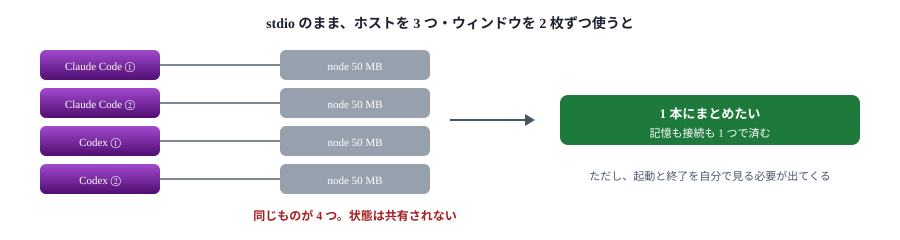
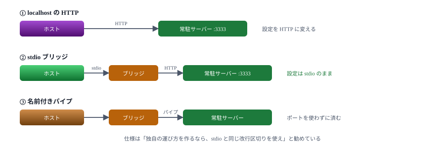
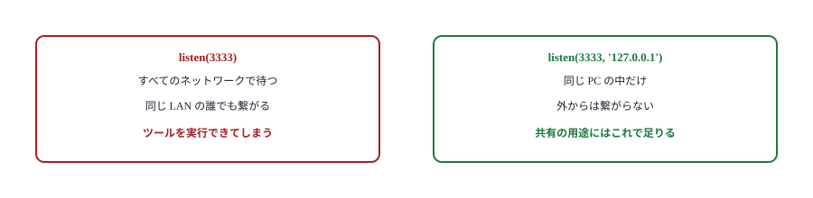
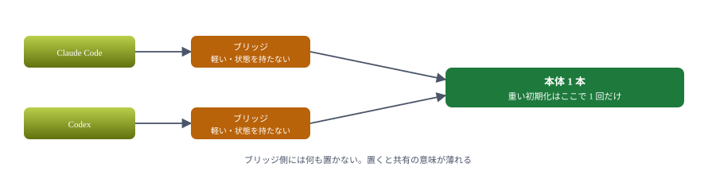

# 10. プロセス共有

同じ PC で 1 本のサーバーを、複数のホストから使う

> 📅 作成: 2026-09-07 / 更新: 2026-10-09

[09. タスク](09-タスク.md)

[目次](../README.md)

[11. ハンズオン② ビルド実行](11-ハンズオン-ビルド実行.md)

## この資料の内容

1. [なぜ 1 本にまとめたいか](#1-なぜ-1-本にまとめたいか)
2. [3 つのやり方](#2-3-つのやり方)
3. [localhost の HTTP](#3-localhost-の-http)
4. [stdio ブリッジ](#4-stdio-ブリッジ)
5. [常駐させる](#5-常駐させる)

## 1. なぜ 1 本にまとめたいか

stdio ではホストが子プロセスを起こします。**ホストが 3 つあれば、同じサーバーが 3 つ立ちます**。ウィンドウを 2 枚開けば 2 倍になります。

| 困ること | 中身 |
|---|---|
| 資源 | Node のプロセスが 1 本あたり数十 MB。10 本立てば無視できない |
| 記憶が分かれる | 記憶の中に持った状態は共有されない。片方で覚えたことを他方は知らない |
| 重い初期化 | 索引の構築や接続の確立を、起動のたびに繰り返す |
| 外部の上限 | API のレート制限や DB の接続数を、プロセスの数だけ食う |



状態を持たないサーバーなら、増えても実害は小さい。共有が効くのは「重い」か「覚える」サーバー。

> [!NOTE]
> <strong>まず、本当に共有が要るか考えてください。</strong>メモサーバーのように状態をファイルに持つなら、プロセスが増えても結果は揃います。**共有が効くのは、起動が重いか、記憶の中に状態を持つ場合**です。

## 2. 3 つのやり方

| やり方 | 仕組み | 難所 |
|---|---|---|
| localhost の HTTP | 常駐を 1 本立て、各ホストは HTTP で繋ぐ | ホスト側の設定を HTTP に変える必要がある |
| stdio ブリッジ | 各ホストには軽い stdio のプロセスを起こさせ、それが常駐へ中継する | ブリッジを自分で書く |
| 名前付きパイプ | stdio と同じ形式をパイプで運ぶ | Windows 固有。SDK に既製品が無い |



②は①の上に薄い層を足しただけ。ホスト側の設定を変えたくないときに効く。

## 3. localhost の HTTP

[07 章](07-HTTPに載せ替える.md)で作ったものが、そのまま使えます。1 本立てて、各ホストから繋ぐだけです。

```powershell
# 常駐させる（1 回だけ）
node docs/samples/07-http/server.mjs --port 3333
```

```powershell
# 各ホストから繋ぐ
claude mcp add --transport http memo http://localhost:3333/mcp
codex mcp add memo --url http://localhost:3333/mcp
```

### 外から叩かれないようにする

`listen(PORT)` はすべてのネットワークで待ち受けます。同じ PC だけに限るなら、明示します。

```javascript
// 127.0.0.1 に限ると、外のマシンからは繋がらない
http.listen(PORT, '127.0.0.1', () => { /* ... */ });
```

> [!NOTE]
> <strong>認証の無いサーバーを外へ出さないでください。</strong>MCP サーバーはツールを実行する仕組みです。誰でも叩ける場所に置けば、誰でもコマンドを走らせられます。共有はあくまで**同じ PC の中**に留めるのが、この章の前提です。



1 引数の `listen` は既定で全方位に開く。共有目的なら必ず絞る。

## 4. stdio ブリッジ

「ホスト側の設定は stdio のままにしたい」「HTTP を知らない人にも配りたい」。そのときはブリッジを挟みます。

やることは単純です。**stdin で受けた行を HTTP に投げ、返ってきたものを stdout に書く**だけ。[samples/10-shared/bridge.mjs](samples/10-shared/bridge.mjs) の全文は 80 行ほどです。

```javascript
// 中継先は引数 --target で受け取る。プロセス一覧で、どこへ繋ぐブリッジか見分けられる
const { values } = parseArgs({
	options: { target: { type: 'string', default: 'http://localhost:3333/mcp' } },
});
const TARGET = values.target;

async function forward(line) {
	const res = await fetch(TARGET, {
		method: 'POST',
		headers: {
			'content-type': 'application/json',
			// どちらの形で返してもよい、と伝える
			accept: 'application/json, text/event-stream',
		},
		body: line,
	});

	// 通知を中継したときは本文が無い（202 が返る）
	if (res.status === 202) return;

	const body = await res.text();
	for (const message of extractMessages(res.headers.get('content-type') ?? '', body)) {
		send(message);
	}
}

rl.on('line', (line) => {
	if (!line.trim()) return;
	forward(line).catch((err) => { /* エラーを返す（後述） */ });
});
```

### 失敗したときに固まらせない

本体が落ちていると `fetch` が失敗します。**何も返さないとホストは待ち続けます**。エラーを返して知らせます。

```javascript
forward(line).catch((err) => {
	log('中継に失敗:', err.message);

	// 応答を待っているホストを固まらせないよう、エラーを返す。
	// 通知（id 無し）には返さない
	let id;
	try { id = JSON.parse(line).id; } catch { /* 壊れた行は無視 */ }
	if (id === undefined) return;

	send(JSON.stringify({
		jsonrpc: '2.0',
		id,
		error: { code: -32603, message: `本体へ中継できない: ${err.message}` },
	}));
});
```

### 確かめる

2 本のブリッジから同じ本体を見ていることを、テストで確かめました。

```javascript
test('2 本のブリッジが同じ本体を見ている（片方で書いた内容が他方で読める）', async () => {
	const a = await bridge();   // node bridge.mjs --target http://localhost:3399/mcp
	const b = await bridge();

	try {
		const mark = `共有の確認 ${Date.now()}`;
		await a.callTool({ name: 'memo_add', arguments: { text: mark } });

		// 別のブリッジから探しても見つかる
		const found = await b.callTool({ name: 'memo_search', arguments: { query: '共有の確認' } });
		assert.match(textOf(found), new RegExp(mark));
	} finally {
		await a.close();
		await b.close();
	}
});
```

```text
✔ ブリッジ越しでもツールの一覧が取れる (843.454ms)
✔ 2 本のブリッジが同じ本体を見ている（片方で書いた内容が他方で読める） (353.484ms)
✔ 本体が落ちているときは接続の時点で失敗する（固まらない） (151.9163ms)
```



ブリッジは中身を持たない。だから何本立ててもよい。

## 5. 常駐させる

共有の形にすると、**本体を誰が起こすか**という問題が出ます。stdio ではホストがやってくれていた仕事です。

| やり方 | 向く場面 | 注意 |
|---|---|---|
| 手で起動 | 試すとき | 閉じ忘れ・起動し忘れが起きる |
| スタートアップ | 自分の PC | ログオンしないと動かない |
| Windows サービス | 常に動かしたい | ユーザープロファイルを見られない場合がある |
| ブリッジが起こす | 起動忘れを無くしたい | 同時に起きたときの競合を自分で捌く |


資源の節約と引き換えに、運用の仕事が増える。小さなサーバーなら stdio のままが楽。

### 選び方

| 状況 | お勧め |
|---|---|
| 状態を持たない・起動が軽い | <strong>共有しない。</strong>stdio のままでよい |
| 起動が重い（索引・接続） | localhost の HTTP |
| 設定を変えたくない・配りたい | stdio ブリッジ |
| ポートを使いたくない | 名前付きパイプ（自分で書く） |

### 次の章へ

最後に、ここまでのものを 1 つにまとめます。コマンドを実行し、進み具合を知らせ、終わったら画面にも出すサーバーを作ります。

[09. タスク](09-タスク.md)

[目次](../README.md)

[11. ハンズオン② ビルド実行](11-ハンズオン-ビルド実行.md)
