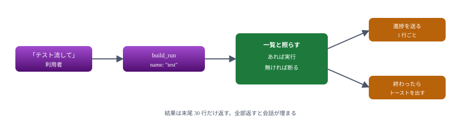
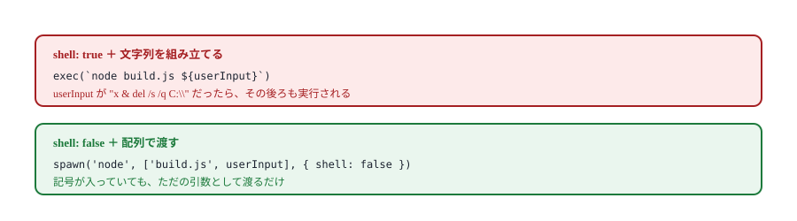
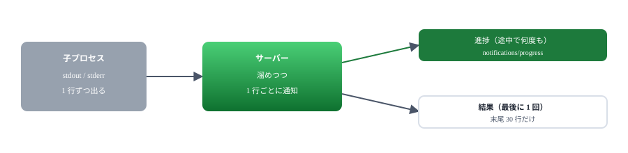
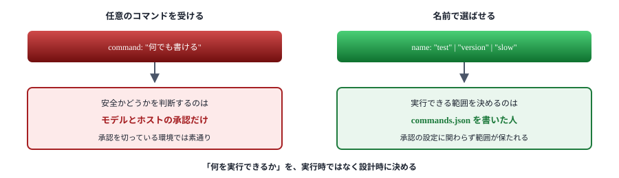

# 11. ハンズオン② ビルド実行

コマンドを実行し、進み具合を知らせ、終わったら画面にも出す

> 📅 作成: 2026-09-07 / 更新: 2026-09-07

[10. プロセス共有](10-プロセス共有.md)

[目次](../README.md)

## この資料の内容

1. [何を作るか](#1-何を作るか)
2. [実行してよいものを決める](#2-実行してよいものを決める)
3. [進み具合を伝える](#3-進み具合を伝える)
4. [終わったら知らせる](#4-終わったら知らせる)
5. [越えてはいけない線](#5-越えてはいけない線)

## 1. 何を作るか

テストやビルドを AI に走らせ、結果を受け取れるようにします。[08 章](08-通知で伝える.md)の通知と、[10 章](10-プロセス共有.md)の考え方を全部使います。

| 出すもの | 名前 | すること |
|---|---|---|
| Resource | `build://commands` | 実行できるコマンドの一覧 |
| Tool | `build_run` | 名前を指定して実行する |



「何でも実行できる」ではなく「決めたものだけ実行できる」形にする。理由は第 5 章。

### 実行してよいものを外に書く

[commands.json](samples/11-build/commands.json) に定義します。コードを直さずに増やせます。

```json
{
	"test": {
		"description": "テストを全件実行する",
		"command": "node",
		"args": ["--test", "tests/"]
	},
	"version": {
		"description": "Node.js の版を表示する",
		"command": "node",
		"args": ["--version"]
	}
}
```

## 2. 実行してよいものを決める

```javascript
// 名前で引ける形にしておく。ここに無いものは実行しない
const commands = JSON.parse(await readFile(COMMANDS_FILE, 'utf8'));

server.registerTool(
	'build_run',
	{
		title: 'コマンドを実行する',
		description: '決めておいたコマンドを名前で指定して実行する',
		inputSchema: {
			name: z.string().describe('commands.json に書いてある名前'),
		},
		annotations: {
			readOnlyHint: false,
			destructiveHint: false,
		},
	},
	async ({ name }, extra) => {
		const spec = commands[name];
		if (!spec) {
			return {
				content: [{
					type: 'text',
					text: `${name} は実行できません。使えるのは ${Object.keys(commands).join(' / ')} です`,
				}],
				isError: true,
			};
		}
		// ...
	},
);
```

> [!NOTE]
> **断るときに「何なら使えるか」を書きます。**「実行できません」だけだと、モデルは同じ名前で何度も試します。使える名前を並べれば、その中から選び直します。[05 章](05-3つの提供物.md)の「失敗の返し方」と同じ考え方です。

### シェルを通さない

```javascript
// シェルを通さない。文字列を組み立てて渡すと、
// 引数に仕込まれた記号がそのまま命令になる
const child = spawn(spec.command, spec.args, { cwd: CWD, shell: false });
```



コマンドと引数を分けて渡せば、記号は解釈されない。文字列を組み立てないのが要点。

### 実行と結果

```javascript
function run(spec, onLine) {
	return new Promise((resolve) => {
		const child = spawn(spec.command, spec.args, { cwd: CWD, shell: false });

		const out = [];
		let lines = 0;

		const pick = (chunk) => {
			const text = chunk.toString();
			out.push(text);
			for (const line of text.split('\n')) {
				if (line.trim()) onLine(++lines, line.trim());
			}
		};

		child.stdout.on('data', pick);
		child.stderr.on('data', pick);

		child.on('error', (err) => resolve({ code: -1, output: `起動できなかった: ${err.message}` }));
		child.on('close', (code) => resolve({ code, output: out.join('') }));
	});
}
```

> [!NOTE]
> **`error` と `close` の両方を拾います。**`error` はコマンドが見つからないときなど、そもそも起動できなかった場合に飛びます。これを拾い忘れると、Promise が解決されず永久に待ち続けます。

## 3. 進み具合を伝える

出力が 1 行出るたびに進捗として送ります。[08 章](08-通知で伝える.md)で見た形です。

```javascript
const token = extra._meta?.progressToken;

const { code, output } = await run(spec, (n, line) => {
	if (token === undefined) return;
	// 総数が分からないので total は付けない
	extra.sendNotification({
		method: 'notifications/progress',
		params: { progressToken: token, progress: n, message: line.slice(0, 80) },
	}).catch(() => { /* 送れなくても本題は続ける */ });
});
```

| やっていること | 理由 |
|---|---|
| `total` を付けない | 何行出るか事前に分からない。`progress` だけ増やせばよい |
| `slice(0, 80)` | 長い行をそのまま流さない |
| `await` しない | 通知の送信でコマンドの読み取りを止めない |
| `.catch()` を付ける | 通知が失敗しても本題は続ける |

### 確かめる

```javascript
test('進捗通知が出力の行ごとに届く', async () => {
	const client = await connect(sample('11-build/server.mjs'));
	const progress = [];

	try {
		await client.callTool(
			{ name: 'build_run', arguments: { name: 'slow' } },
			undefined,
			{ onprogress: (p) => progress.push(p) },
		);

		// 1 秒ごとに 1 行出るコマンドなので 3 回来る
		assert.equal(progress.length, 3);
		assert.equal(progress[0].message, '1');
		assert.equal(progress[2].message, '3');
	} finally {
		await client.close();
	}
});
```

```text
✔ 実行できるコマンドの一覧を読める (465.2207ms)
✔ 決めたコマンドは実行でき、終了コードが 0 なら成功と返る (470.6477ms)
✔ 一覧に無いものは実行せずに断る (402.7811ms)
✔ 進捗通知が出力の行ごとに届く (3450.8708ms)
```



途中は通知、最後は結果。全出力を結果に詰め込まない。

## 4. 終わったら知らせる

```javascript
const seconds = ((Date.now() - started) / 1000).toFixed(1);
const ok = code === 0;

await toast(ok ? `${name} 成功` : `${name} 失敗`, `${seconds} 秒 / 終了コード ${code}`);

// 出力が長いと会話を埋めてしまう。末尾だけ返す
const tail = output.split('\n').slice(-30).join('\n');

return {
	content: [{
		type: 'text',
		text: `${ok ? '成功' : '失敗'}（終了コード ${code}、${seconds} 秒）\n\n${tail}`,
	}],
	isError: !ok,
};
```

トーストは [08 章](08-通知で伝える.md)のものを使い回します。失敗しても本題は止めません。

```javascript
async function toast(title, message) {
	if (!TOAST) return;
	try {
		await execFileAsync('powershell', [ /* ... */ ]);
	} catch {
		// 知らせられなくても本題は済んでいる。落とさない
	}
}
```

> [!NOTE]
> <strong>通知は既定で切っておきます。</strong>環境変数 `BUILD_TOAST=1` のときだけ出す形にしました。テストのたびに画面へトーストが出ては邪魔になります。**人の環境を邪魔する機能は、既定で切る**のが作法です。

### 返す量を絞る


何を残すかは対象による。テストなら末尾、ビルドのエラーなら該当箇所の周辺。

### 登録して使う

```json
{
	"mcpServers": {
		"build": {
			"command": "node",
			"args": ["docs/samples/11-build/server.mjs"],
			"env": { "BUILD_TOAST": "1" }
		}
	}
}
```

「テストを流して」と頼めば実行され、進み具合が表示され、終わればトーストが出ます。

## 5. 越えてはいけない線

コマンドを実行するサーバーは、**作れるものの中で最も危ないもの**です。線を引いておきます。

| やってはいけないこと | なぜ |
|---|---|
| 任意のコマンドを受け取って実行する | モデルが誤ったものを渡せば、そのまま実行される |
| 引数を文字列で組み立てて `shell: true` で渡す | 記号が命令として解釈される |
| 作業場所を呼ぶ側に決めさせる | どこでも実行できてしまう |
| 結果に環境変数をそのまま載せる | 認証情報が会話に流れる |
| 認証なしで HTTP に出す | 同じネットワークの誰でも実行できる |



ホスト側の承認は最後の砦であって、最初の砦ではない。範囲はサーバー側で決める。

> [!NOTE]
> <strong>ツールの説明文は信用されない前提で設計します。</strong>仕様にも「注釈は信用できないものとして扱え」とあります。「危険なので確認してください」と `description` に書いても、それは**お願い**にすぎません。実際に守らせるには、サーバー側で実行できる範囲を絞るしかありません。

### ここまでで身に付いたこと

| 章 | できるようになったこと |
|---|---|
| 02・03 | JSON-RPC で何が流れているか分かる。SDK でも手書きでも書ける |
| 04 | 3 つのホストに登録し、動かないときに切り分けられる |
| 05・06 | Tools・Resources・Prompts を使い分け、失敗を正しく返せる |
| 07・10 | stdio と HTTP を選び、1 本を共有できる |
| 08・09 | 伝えられること・伝えられないことの線が引ける |
| 11 | 危ないものを、危なくない形にして出せる |

詰まったときは [A2. 詰まったとき](A2-詰まったとき.md) を、やり方を忘れたときは [A1. 逆引き](A1-逆引き.md) を引いてください。Node.js を入れられない環境へ配る話は [A3. 単一 exe にする](A3-単一exeにする.md) にあります。

[10. プロセス共有](10-プロセス共有.md)

[目次](../README.md)
