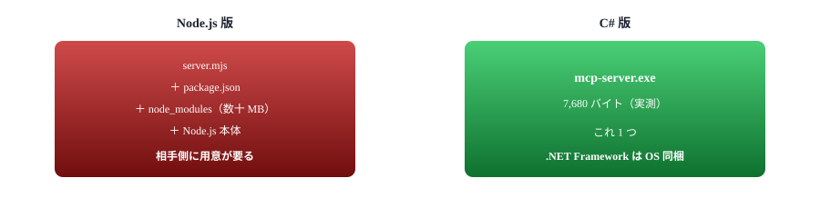
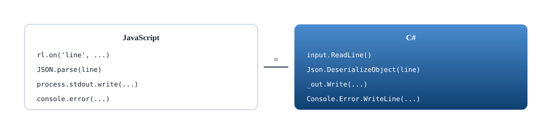
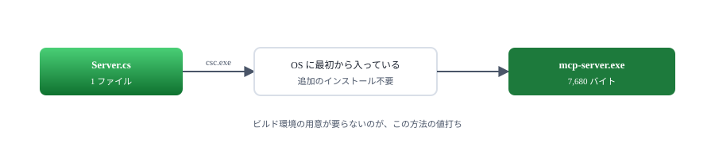
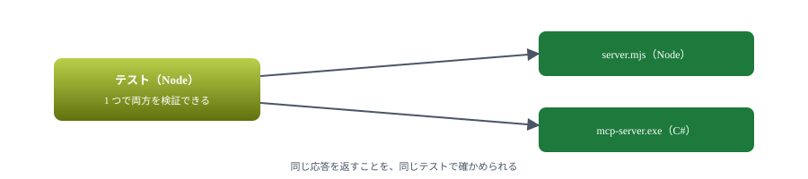

# A3. 単一 exe にする

Node.js を入れられない相手へ配る。C# ＋ csc.exe

> 📅 作成: 2026-09-07 / 更新: 2026-09-07

[目次](../README.md)

## この資料の内容

1. [なぜ exe にするか](#1-なぜ-exe-にするか)
2. [書く](#2-書く)
3. [ビルドする](#3-ビルドする)
4. [動かす](#4-動かす)
5. [Node 版との違い](#5-node-版との違い)

## 1. なぜ exe にするか

Node.js 版は、渡す相手にも Node.js が要ります。それが難しい場面があります。

| 場面 | 事情 |
|---|---|
| 社内の共有 PC | ランタイムを勝手に入れられない |
| 相手が開発者でない | `npm install` を頼めない |
| 版がばらばら | 入っている Node.js の版が揃わない |
| 起動を速くしたい | 多数のプロセスが立つとき |

<strong>.NET Framework 4.x は Windows 10・11 に最初から入っています。</strong>そのコンパイラ（`csc.exe`）も同梱されているので、追加で何も入れずに exe を作れます。



この章のサンプルをビルドすると、実測 7,680 バイトの exe が 1 つできる。

> [!NOTE]
> <strong>MCP は言語に依りません。</strong>やることは「標準入出力で改行区切りの JSON をやりとりする」だけです。[02 章](02-最小のサーバー.md)で手書きしたものを、そのまま C# に移すだけで動きます。

## 2. 書く

全文は [samples/A3-csharp/Server.cs](samples/A3-csharp/Server.cs) にあります。要点だけ見ます。

### 文字コードを間違えない

```csharp
// BOM を付けない UTF-8 にする。BOM を出すと相手が JSON として読めない
var utf8 = new UTF8Encoding(false);
var input = new StreamReader(Console.OpenStandardInput(), utf8);
_out = new StreamWriter(Console.OpenStandardOutput(), utf8);
_out.AutoFlush = true;
```

> [!NOTE]
> **ここが最大の落とし穴です。**`new UTF8Encoding(true)` や既定の設定だと、最初の出力に BOM（`EF BB BF`）が付きます。相手はそれを JSON の一部として読もうとして失敗します。**しかも 1 通目だけが壊れる**ので、原因に気づきにくくなります。

`AutoFlush = true` も要ります。付けないと応答が溜まったまま送られず、相手は待ち続けます。

### JSON を扱う

.NET Framework には `JavaScriptSerializer` が入っています。参照を 1 つ足すだけで使えます。

```csharp
using System.Web.Script.Serialization;

static readonly JavaScriptSerializer Json = new JavaScriptSerializer();

// 読む: Dictionary<string, object> になる
var request = (Dictionary<string, object>)Json.DeserializeObject(line);

// 書く
_out.Write(Json.Serialize(message));
```

### 受け取って返す

```csharp
string line;
while ((line = input.ReadLine()) != null)
{
	if (line.Trim().Length == 0) continue;
	Log("受信: " + line);

	Dictionary<string, object> request;
	try
	{
		request = (Dictionary<string, object>)Json.DeserializeObject(line);
	}
	catch
	{
		Log("JSON として読めなかった行を捨てた");
		continue;
	}

	// id が無いものは通知。応答してはいけない
	if (!request.ContainsKey("id"))
	{
		Log("通知: " + Get(request, "method"));
		continue;
	}

	Handle(request);
}
```

ログは stderr へ出します。Node 版と同じ約束です。

```csharp
// stdout は JSON-RPC 専用。ログは stderr へ出す
static void Log(string message)
{
	Console.Error.WriteLine("[csharp] " + message);
}
```



1 対 1 で移せる。プロトコルの側に言語の都合は無い。

## 3. ビルドする

```batch
"%WINDIR%\Microsoft.NET\Framework64\v4.0.30319\csc.exe" /nologo /optimize /utf8output ^
	/out:mcp-server.exe /r:System.Web.Extensions.dll Server.cs
```

| オプション | 意味 |
|---|---|
| `/optimize` | 最適化する |
| `/utf8output` | コンパイラのメッセージを UTF-8 で出す。日本語のエラーが化けない |
| `/out:` | できる exe の名前 |
| `/r:` | 参照する DLL。`JavaScriptSerializer` に要る |

ダブルクリックで作れるよう [build.cmd](samples/A3-csharp/build.cmd) を置いてあります。64 ビット版が無ければ 32 ビット版を探すようにしています。

```batch
set CSC=%WINDIR%\Microsoft.NET\Framework64\v4.0.30319\csc.exe
if not exist "%CSC%" set CSC=%WINDIR%\Microsoft.NET\Framework\v4.0.30319\csc.exe
if not exist "%CSC%" (
	echo csc.exe が見つかりません。.NET Framework 4.x が入っているか確認してください
	pause
	exit /b 1
)
```

実行するとこうなります。

```text
できた: mcp-server.exe (7,680 バイト)
```



SDK も NuGet もパッケージマネージャも使わない。ソース 1 枚とコンパイラだけ。

## 4. 動かす

```powershell
@(
'{"jsonrpc":"2.0","id":1,"method":"initialize","params":{"protocolVersion":"2025-11-25","capabilities":{},"clientInfo":{"name":"手","version":"1.0"}}}'
'{"jsonrpc":"2.0","method":"notifications/initialized"}'
'{"jsonrpc":"2.0","id":2,"method":"tools/list"}'
'{"jsonrpc":"2.0","id":3,"method":"tools/call","params":{"name":"add","arguments":{"a":2,"b":3}}}'
) -join "`n" | ./mcp-server.exe
```

実際の出力です。

```text
[csharp] 起動した
[csharp] 受信: {"jsonrpc":"2.0","id":1,"method":"initialize",...}
{"jsonrpc":"2.0","id":1,"result":{"protocolVersion":"2025-11-25","capabilities":{"tools":{}},"serverInfo":{"name":"csharp","version":"1.0.0"}}}
[csharp] 受信: {"jsonrpc":"2.0","method":"notifications/initialized"}
[csharp] 通知: notifications/initialized
[csharp] 受信: {"jsonrpc":"2.0","id":2,"method":"tools/list"}
{"jsonrpc":"2.0","id":2,"result":{"tools":[{"name":"add","description":"2 つの数を足す",...}]}}
[csharp] 受信: {"jsonrpc":"2.0","id":3,"method":"tools/call",...}
{"jsonrpc":"2.0","id":3,"result":{"content":[{"type":"text","text":"5"}]}}
```

### 登録する

```powershell
claude mcp add csharp -- docs/samples/A3-csharp/mcp-server.exe
```

コマンドが exe になるだけで、あとは Node 版と同じです。

### テストも同じ道具で書ける

クライアント側は Node のままでよいので、Node 版と同じテストの仕組みが使えます。

```javascript
test('C# 版でも日本語が壊れない', { skip }, async () => {
	const client = await connect(EXE, { command: EXE });

	try {
		// BOM を付けずに UTF-8 で書き出しているかの確認でもある
		const { tools } = await client.listTools();
		assert.equal(tools[0].description, '2 つの数を足す');

		const result = await client.callTool({ name: 'add', arguments: { a: 'あ', b: 3 } });
		assert.equal(result.isError, true);
		assert.match(textOf(result), /数値を渡してください/);
	} finally {
		await client.close();
	}
});
```

```text
✔ C# 版でもツールの一覧と実行が通る (128.4249ms)
✔ C# 版でも日本語が壊れない (104.3658ms)
✔ C# 版でも小数を扱える (101.7517ms)
```



2 つの実装を並行して持つときも、検証は 1 か所で済む。

## 5. Node 版との違い

| 項目 | Node ＋ SDK | C# ＋ csc.exe |
|---|---|---|
| 配るもの | ソース ＋ node_modules ＋ ランタイム | **exe 1 つ** |
| 大きさ | 数十 MB | 7,680 バイト（実測） |
| 入力の検証 | SDK が zod で行う | **自分で書く** |
| JSON-RPC の組み立て | SDK が行う | **自分で書く** |
| HTTP に載せる | 差し替えるだけ | 自分で書く |
| タスク・通知 | SDK に用意がある | 自分で書く |
| 仕様の追随 | SDK の更新に乗れる | **自分で追う** |
| 直しやすさ | 再起動だけ | ビルドし直して配り直す |


どちらが上ではなく、何を優先するかの選択。

### 選び方

| 状況 | お勧め |
|---|---|
| 自分と同僚が使う | <strong>Node ＋ SDK。</strong>作るのが速い |
| 開発者でない相手に配る | C# ＋ csc.exe |
| ツールが 1〜2 個だけ | C# でも負担は小さい |
| 通知やタスクを使う | Node ＋ SDK。自前で書くと大仕事になる |
| 両方要る | 中身を分けておき、入り口だけ 2 つ作る |

> [!NOTE]
> <strong>まず Node ＋ SDK で作り、必要になってから移すのが現実的です。</strong>プロトコルは同じなので、動くものができてからの移植は難しくありません。**最初から C# で書くと、仕様の理解と実装の両方を同時にやることになります。**

[目次](../README.md)
