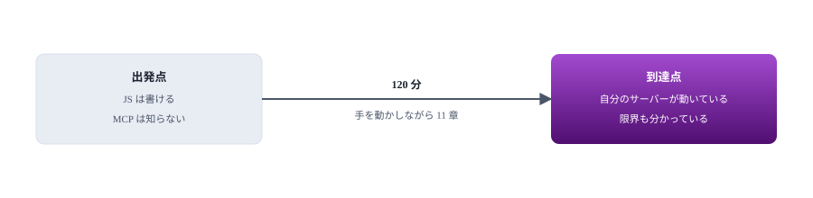
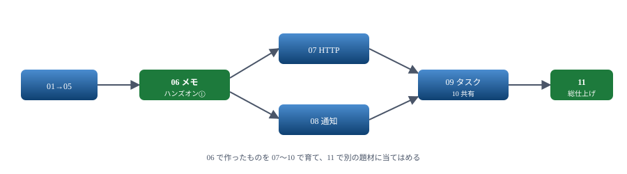
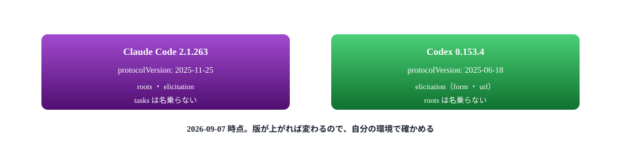

# ZZ. 構成

この資料をどう組み立てたか

> 📅 作成: 2026-09-07 / 更新: 2026-09-07

[目次](../README.md)

## この資料の内容

1. [対象読者](#1-対象読者)
2. [章立ての意図](#2-章立ての意図)
3. [書き方の原則](#3-書き方の原則)
4. [確かめた環境](#4-確かめた環境)
5. [読み方](#5-読み方)

## 1. 対象読者

| 項目 | 前提 | 理由 |
|---|---|---|
| MCP | まったく知らない | 用語から説明する。既に知っている人は 02 章から読める |
| JavaScript | 文法は分かる | `async`／`await`・モジュール・分割代入は説明しない |
| AI コーディング CLI | 使ったことがある | ただし MCP の登録は初めての前提 |
| サーバー開発 | プロセスと標準入出力が分かる | JSON-RPC は知らない前提で説明する |

### 到達点

- MCP が何を運ぶ規約かを、ホスト・クライアント・サーバーの関係で説明できる
- stdio のサーバーを書き、3 つの CLI のどれにでも登録できる
- 同じサーバーを HTTP に載せ替え、1 本を共有できる
- **できないことの線が引ける**（何を諦め、何を別の手で解くか判断できる）
- 詰まったときに、どこを見れば分かるかが分かる



読み物ではなく、手を動かす前提で組んである。

## 2. 章立ての意図

| 章 | 役割 | 目安 |
|---|---|---:|
| 01 背景 | 用語を揃える。**版が 1 つでない**ことを最初に伝える | 8 分 |
| 02 最小のサーバー | <strong>この資料の要。</strong>SDK 抜きで書き、中身を見せる | 15 分 |
| 03 SDK で書き直す | 02 と同じものを短く書き、何が省けたかを対比する | 10 分 |
| 04 ホストに登録する | 3 つの CLI の違い。**切り分けの方法**もここ | 12 分 |
| 05 3 つの提供物 | Tools・Resources・Prompts の使い分けと失敗の返し方 | 13 分 |
| 06 ハンズオン① | ここまでを使って作りきる。以降の章はこれを育てる | 12 分 |
| 07 HTTP に載せ替える | 中身を変えずに運び方だけ変える | 12 分 |
| 08 通知で伝える | **できることとできないことの線を引く** | 10 分 |
| 09 タスク | 新しい仕組みと、まだ使われていない現実 | 10 分 |
| 10 プロセス共有 | 1 本にまとめる方法と、その代償 | 8 分 |
| 11 ハンズオン② | 危ないものを、危なくない形にして出す | 10 分 |

### 02 章を SDK より先に置いた理由

SDK から始めれば 20 行で動きます。それでも先に手書きを挟むのは、**動かないときに切り分けられなくなる**からです。

登録したのにツールが出てこない。このとき「プロセスは起きているか」「初期化まで進んだか」「一覧は渡ったか」を確かめられるかどうかで、解決までの時間が変わります。02 章で 1 往復させておけば、以降どの章で詰まっても同じやり方で調べられます。



ハンズオンを 2 つに分け、間に応用の章を挟んである。

## 3. 書き方の原則

| 原則 | 中身 |
|---|---|
| 生のものを先に | SDK より先に JSON-RPC を見せる。抽象の下に何があるかを知ってから使う |
| 理由を先に | 「`console.log` は禁止」ではなく「なぜ壊れるか」から書く |
| 動かして終わる | 各節は実行結果で終える。**出力は実際に動かしたものを貼る** |
| 実測を書く | 版・大きさ・所要時間はコマンドで確かめた値を書く |
| できないことも書く | できることだけ並べると、できないことに時間を溶かす |
| ホストの差はバッジで | 3 つの CLI で違う箇所は明示する |

### 載せているコードは全部動かしてある

資料に出てくるサーバーは [docs/samples/](samples/) に置いてあり、テストで検証しています。

```powershell
node --test --test-concurrency=1 tests/
```

```text
ℹ tests 32
ℹ pass 32
ℹ fail 0
```

> [!NOTE]
> <strong>出力は実際に動かしたものです。</strong>この資料に貼ってある実行結果・エラーメッセージ・所要時間は、書き起こしではなく実行して得たものを写しています。バージョン番号も `--version` で確かめた値です。

### 図について

各章に図を 1 点以上入れています。引くための付録（A1・A2）は除きます。図はすべて SVG で、章のアクセント色を継いでいます。

## 4. 確かめた環境

| 対象 | 版 | 確かめ方 |
|---|---|---|
| OS | Windows 11 | — |
| Node.js | v26.8.1 | `node --version` |
| npm | 11.19.0 | `npm --version` |
| @modelcontextprotocol/sdk | 1.30.0 | `npm view @modelcontextprotocol/sdk version` |
| zod | 4.5.4 | `npm ls zod` |
| Claude Code | 2.1.263 | `claude --version` |
| Codex | 0.153.4 | `codex --version` |
| Antigravity | 1.107.0 | `antigravity --version` |
| .NET Framework | 4.0.30319 | `csc.exe` の置き場 |

### どこまで実測したか

| 対象 | 範囲 |
|---|---|
| Claude Code | ✅ **全章** 登録・呼び出し・進捗通知・elicitation・タスクの非対応まで確認 |
| Codex | ⚠️ **一部** 接続と `protocolVersion` の確認まで |
| Antigravity | ⬜ **未** 登録コマンドの書式のみ |



この違いに気づかず片方に合わせると、もう片方で動かなくなる。

## 5. 読み方

| 目的 | 読む順 |
|---|---|
| ひととおり身に付けたい | 01 から順に。120 分 |
| とにかく動かしたい | 03 → 04 → 06。35 分 |
| 中身を理解したい | 01 → 02 → 08。33 分 |
| 共有の構成を知りたい | 07 → 10。20 分 |
| 通知の限界を知りたい | 08 → 09。20 分 |
| 配る方法を知りたい | [A3](A3-単一exeにする.md) |
| 詰まった | [A2](A2-詰まったとき.md) |
| 書き方を忘れた | [A1](A1-逆引き.md) |

### 手を動かす準備

```powershell
git clone <このリポジトリ>
cd 20260907-ai-mcp-servers-learn
npm install
node --test --test-concurrency=1 tests/
```

テストが全件通れば、資料に出てくるサーバーはすべて手元で動きます。

### 参考にした資料

| 資料 | 使い方 |
|---|---|
| [MCP 仕様 2025-11-25](https://modelcontextprotocol.io/specification/2025-11-25/) | <strong>これが正。</strong>この資料と食い違ったら仕様に従う |
| [MCP 仕様（最新）](https://modelcontextprotocol.io/specification/) | 先の変更を知りたいとき。今のホストは追いついていない |
| SDK の型定義 | `node_modules/@modelcontextprotocol/sdk/dist/esm/**/*.d.ts` |

> [!NOTE]
> <strong>仕様のページは日付で分かれています。</strong>検索から辿り着いたページの URL に入っている日付を確かめてください。`2026-07-28` のページは、この資料が扱う `2025-11-25` とは作りが違います。

[目次](../README.md)
