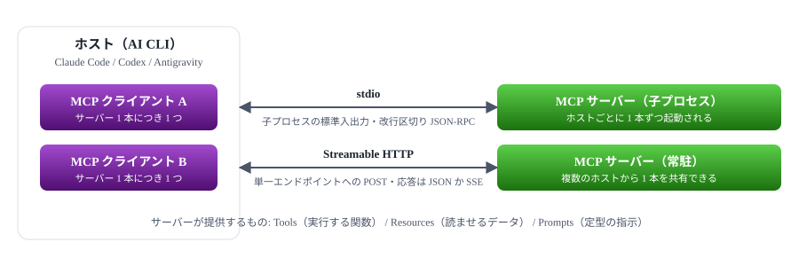

# MCP Server 学習資料 計画

Claude Code・Codex・Antigravity CLI 向けの MCP Server を、いちから作れるようになるための資料をどう組み立てるか

> 📅 作成: 2026-09-07 / 更新: 2026-09-07

[⌂](../../README.md)

## 目次

1. [この資料で何を作るか](#1-この資料で何を作るか)
2. [前提の実測と仕様の現状](#2-前提の実測と仕様の現状)
3. [参考資料から引き継ぐ方針](#3-参考資料から引き継ぐ方針)
4. [資料の構成案](#4-資料の構成案)
5. [決めたこと](#5-決めたこと)
6. [作業の進め方](#6-作業の進め方)

## 1. この資料で何を作るか

### 目的

MCP（Model Context Protocol）Server を **いちから自分で書けるようになる**ための学習資料を作る。読んで終わりではなく、手元で動く MCP Server を持ち帰り、Claude Code・Codex・Antigravity CLI から実際に呼び出せる状態にする。

### 対象読者

| 項目 | 内容 |
|---|---|
| MCP の知識 | **まったく無い**ことを前提にする。「MCP という言葉は聞いたことがある」程度から始める |
| JavaScript | 文法は十分に知っている。`async`／`await`・モジュール・クラスの説明は不要 |
| AI コーディング CLI | Claude Code・Codex を「とりあえず使える」水準。設定ファイルの場所や MCP の登録方法は知らない前提 |
| サーバー開発 | HTTP・プロセス・標準入出力の概念は分かるが、JSON-RPC は知らないかもしれない前提 |

### ゴール

- MCP が**何を運ぶ規約**なのかを、ホスト・クライアント・サーバーの関係で説明できる
- stdio の MCP Server を自分で書き、Claude Code に登録して呼び出せる
- 同じサーバーを Streamable HTTP に載せ替えられる
- 詰まったときに**どこを見れば分かるか**（ログ・仕様書・SDK の型定義）が分かる

### 想定時間

**120 分**。読み物として通読するのではなく、手を動かしながら進む前提で時間を配分する。配分案は第 4 章に置く。

当初は 90 分・本編 8 章で見積もっていたが、Tasks 拡張（論点 6-B）と stdio ブリッジ（論点 7-B）まで扱うと決めたため、本編 11 章・120 分に改めた。章を 2 部に割らず、通しの 1 本として構成する。

> [!NOTE]
> **この資料が扱わないもの**：MCP Client（ホスト側）の実装、LLM そのものの仕組み、TypeScript の型システム（別資料に譲る）。

## 2. 前提の実測と仕様の現状

### 実行環境（2026-09-07 時点の実測値）

| 対象 | バージョン | 確認方法 |
|---|---|---|
| Node.js | v26.8.1 | `node --version` |
| npm | 11.19.0 | `npm --version` |
| @modelcontextprotocol/sdk | 1.30.0 | `npm view @modelcontextprotocol/sdk version` |
| MCP 仕様（最新） | 2026-07-28 | 仕様サイトの最新リビジョン |
| MCP 仕様（**資料の基準**） | 2025-11-25 | Claude Code が実際に喋る版。次節で実測した |
| Claude Code | 2.1.263 | `claude --version` |
| Codex | 0.153.4 | `codex --version` |
| Antigravity | 1.107.0 | `antigravity --version` |

### ステップ 0 の実測結果（資料の前提が決まった）

3 つの CLI に接続させて、届いた `initialize` を記録した。**最新の 2026-07-28 を喋る CLI は無かった。**

| ホスト | 版 | 名乗った能力 | tasks |
|---|---|---|---|
| Claude Code 2.1.263 | 2025-11-25 | `roots` ・ `elicitation` | ❌ **非対応** |
| Codex 0.153.4 | 2025-06-18 | `elicitation`（form ・ url） | ⬜ **未確認** |
| Antigravity 1.107.0 | — | — | ⬜ **未確認** |

> [!NOTE]
> <strong>この結果を受けて、資料は 2025-11-25 を基準にした（論点 2 の A）。</strong>2025-11-25 は 2026-07-28 とは作りが違い、**接続ごとの状態を持ち、サーバーからクライアントへリクエストを送れる**（sampling・roots・elicitation）。タスクもコア仕様に入っている。以下に残した 2026-07-28 の記述は**将来の変更点**として読むこと。

> [!NOTE]
> <strong>Tasks は Claude Code では使われなかった。</strong>サーバー側で `capabilities.tasks` を名乗り、ツールに `taskSupport: 'optional'` を付けても、`task` を付けずに普通に呼んでくる。仕様どおりの動きであり、09 章にはこの実測をそのまま書いた。

### 仕様 2026-07-28 で押さえるべき点（将来の変更）

#### 標準トランスポートは 2 つ

| トランスポート | 内容 | 位置づけ |
|---|---|---|
| stdio | クライアントが起動した子プロセスの標準入出力に、改行区切りの JSON-RPC を流す | ✅ **標準** |
| Streamable HTTP | 1 つのエンドポイントへの HTTP POST。応答は JSON か、そのリクエスト専用の SSE ストリーム | ✅ **標準** |
| HTTP+SSE（旧） | 旧リビジョンの方式。後方互換として扱われ、標準の一覧からは外れている | ⚠️ **互換のみ** |
| カスタム | TCP・Unix ドメインソケット・名前付きパイプなど。**stdio と同じ改行区切りのフレーミングを再利用することが推奨** | ⬜ **任意** |

ホスト・クライアント・サーバーの関係。プロセスを共有できるかどうかはトランスポートの選択で決まる。

#### サーバーからクライアントへ「リクエスト」は送れない

2026-07-28 では、運べるメッセージの向きが次の 4 つに限定されている。

| 向き | リクエスト | 通知 | レスポンス |
|---|---|---|---|
| クライアント → サーバー | ✅ **可** | ✅ **可** | ❌ **不可** |
| サーバー → クライアント | ❌ **不可** | ✅ **可** | ✅ **可** |

> [!NOTE]
> <strong>「push 通知を送りたい」はここに直撃する。</strong>旧リビジョンではサーバーがクライアントへリクエストを投げられたが、現行仕様では `Servers MUST NOT initiate JSON-RPC requests` と明記され、**通知とレスポンスだけ**になった。何をどこまで実現できるかは第 5 章の論点 6 に表でまとめている。

#### 通知はクライアントが張ったストリームに流れる

サーバーが勝手に送りつけるのではなく、**通知には必ず流し込む先が要る**。先は 2 通りある。

| 流し先 | 作られ方 | 送れる通知 |
|---|---|---|
| 処理中のリクエスト | クライアントのリクエストを処理している間だけ開いている | `notifications/progress`・`notifications/message` |
| 購読ストリーム | クライアントが `subscriptions/listen` を送ると、**その応答が長寿命の通知ストリームになる** | 一覧の変化・資源の更新・`notifications/tasks` など |

どちらも**起点はクライアント**である。接続が無い相手へサーバーから届ける経路は無い。

#### 問いかけは「入力が要る」という結果で表す

サーバーが利用者に尋ねたいとき（確認・選択・sampling）は、リクエストを送るのではなく `InputRequiredResult` を**結果として返す**。クライアントは答えを `inputResponses` に添えて同じリクエストを送り直す。これを Multi Round-Trip Requests（MRTR）と呼ぶ。Tasks 拡張では、これがタスクの `input_required` 状態と `tasks/update` に対応する。

#### ステートレスになった

旧リビジョンは `initialize` ハンドシェイクで接続ごとのセッションを張っていたが、現行仕様では**リクエスト 1 本が自己完結**し、プロトコルバージョンとクライアント能力は毎回 `_meta.io.modelcontextprotocol/*` に載る。これは**プロセス共有と相性がよい**（論点 7 で扱う）。

> [!NOTE]
> <strong>各 CLI が実際に喋るリビジョンは未確認。</strong>Claude Code・Codex・Antigravity CLI が 2026-07-28 に追随しているとは限らない。これは資料の内容を左右するため、**執筆前に実測する**（第 6 章 ステップ 0）。

## 3. 参考資料から引き継ぐ方針

既存の TypeScript 学習資料・PowerShell 学習資料と同じ作りにする。読み手が同じシリーズとして読めることを優先する。

### 踏襲する形

| 項目 | 内容 |
|---|---|
| ファイル構成 | `docs/` に本編 `01-〜.html`、付録 `A1-〜.html`、構成案 `ZZ-構成.html`。root に `README.html` |
| 番号体系 | 「資料番号.章番号」（資料 03 の章は `03.1`・`03.2`…） |
| ナビゲーション | 本文先頭とフッターの両方に **前へ・次へ・目次** のバッジ。付録は目次のみ |
| 色 | 資料ごとに通し色相（280°→0°）。章見出しは資料内で虹色 |
| 公開 | GitHub Pages（public）。`index.html` から `README.html` へリダイレクト |
| Markdown | HTML を正とし、html2md で生成。SVG は `images/` へ切り出す |

### 執筆原則（この資料向けに読み替えたもの）

TypeScript 資料は「同じ処理の JavaScript を並べる」「理由を先に説明する」「短い実行例で終わる」を原則にしていた。MCP は言語ではなく**プロトコル**なので、次のように置き換える。

1. <strong>生の JSON-RPC を先に見せ、SDK は後から出す。</strong>SDK から入ると「何が起きているか分からないまま動く」状態になり、詰まったときに調べられない
2. **理由を先に説明する。**「なぜ stdout にログを書いてはいけないのか」を、規約ではなく壊れ方で示す
3. <strong>各節は動かして終わる。</strong>節の終わりに必ず実行結果を貼る。出力は実測を貼り、書き起こさない
4. **ホストごとの差はバッジで示す**。⬜ **Claude Code** ⬜ **Codex** ⬜ **Antigravity** の 3 つで登録方法が違うため、設定ファイルの話は必ずバッジを添える
5. <strong>エラーメッセージは実際に出るものを載せる。</strong>英語なら英語のまま載せ、訳を添える

## 4. 資料の構成案

本編 11 章＋付録 3 本（TypeScript 版の A4 は本編を書き終えてから）。120 分で本編を通せる分量にする。ハンズオンを 2 つに割り、前半で作ったサーバーを後半で育てる形にする。

### 本編

| 番号 | タイトル | 扱う内容 | 目安 |
|---|---|---|---:|
| 01 | 背景 | MCP が無かった頃は何をしていたか。なぜ規約が要ったか。ホスト・クライアント・サーバーの関係。LSP との類似 | 8 分 |
| 02 | 最小のサーバー | JSON-RPC を手で書いて標準入出力に流す。SDK を使わず、初期化とツール 1 個の応答だけを返す。**ここで中身を見せておく** | 15 分 |
| 03 | SDK で書き直す | 02 と同じものを `@modelcontextprotocol/sdk` で書く。何が省けたかを対比する | 10 分 |
| 04 | ホストに登録する | Claude Code・Codex・Antigravity CLI それぞれの登録方法。設定ファイルの場所と書式。動かないときの切り分け | 12 分 |
| 05 | Tools・Resources・Prompts | 3 種類の提供物の違いと使い分け。入力スキーマの書き方。エラーの返し方 | 13 分 |
| 06 | ハンズオン① メモサーバー | お題 A。メモを検索・追記するサーバーを 01〜05 の内容で作りきる。**以降の章はこれを育てる** | 12 分 |
| 07 | Streamable HTTP | 06 のサーバーを HTTP に載せ替える。stdio との違い、いつどちらを選ぶか | 12 分 |
| 08 | 通知で結果を伝える | 進捗通知とログ通知。`subscriptions/listen` の仕組み。サーバー起点でできること・できないことの線。OS のトースト通知という枠外の手 | 10 分 |
| 09 | Tasks 拡張 | 長い処理を投げて後から結果を取る。`tasks/get` によるポーリングと `notifications/tasks` による push。拡張の合意が要ること | 10 分 |
| 10 | プロセス共有 | 同一 PC で 1 本のサーバーを共有する 3 方式の比較。localhost HTTP と stdio ブリッジを実装する | 8 分 |
| 11 | ハンズオン② ビルド実行サーバー | お題 B。開発コマンドを実行し、終わったら知らせ、複数のホストで共有する。07〜10 の総仕上げ | 10 分 |

### 付録

| 番号 | タイトル | 扱う内容 |
|---|---|---|
| A1 | 逆引き | 「〜したい」から引く。ツールを増やす／ログを見る／登録を消す／バージョンを確かめる |
| A2 | 詰まったとき | 症状から原因へ。サーバーが起動しない・ツールが見えない・応答が返らない・stdout 汚染 |
| A3 | C# で書く | `csc.exe` で単一 exe にする構成。Node.js を入れられない相手へ配るときの選択肢 |
| A4 | TypeScript で書く | 本編のサーバーを TypeScript に置き換える。**本編を書き終えた後に着手する**（論点 1 の C） |

> [!NOTE]
> <strong>02 章を SDK より先に置くのがこの構成の肝。</strong>SDK から入ると `server.tool(...)` を書けば動いてしまい、登録が効かないときに「どこまで届いているか」を確かめる手段が無くなる。手で JSON-RPC を 1 往復させておくと、以降すべての章で切り分けができる。

## 5. 決めたこと

資料を書き始める前に決めた項目。**採った案を見出しのバッジで示し、案とその理由は残す**。後から「なぜこうしたか」を辿れるようにするため。

### 決定の一覧

| 論点 | 採用 | 内容 |
|---|---|---|
| 1. 実装言語 | ✅ **A + C** | 本編は JavaScript（ESM・`.mjs`）。TypeScript 版は本編を書き終えてから付録 A4 として足す |
| 2. 仕様リビジョン | ✅ **A** | 3 つの CLI が実際に喋るリビジョンに合わせる。**各章を書きながら CLI で検証する** |
| 3. C# | ✅ **A** | 付録 A3 に 1 本。本編は Node.js のみ |
| 4. ハンズオン | ✅ **A + B** | 2 題とも扱う。06 章でメモサーバー（A）、11 章でビルド実行サーバー（B） |
| 5. 実測範囲 | ✅ **A** | Claude Code で全章を実測。Codex・Antigravity は登録方法と疎通のみ |
| 6. push 通知 | ✅ **A + B** | できること・できないことを示し、進捗通知と OS トースト通知を実装（08 章）。Tasks 拡張も実装まで踏み込む（09 章） |
| 7. プロセス共有 | ✅ **A + B** | 3 方式を図で比較し、localhost HTTP と stdio ブリッジの両方を実装（10 章） |
| 8. リポジトリ | ✅ **A** | `20260907-ai-mcp-servers-learn`・public・Pages は `develop` の `/` |
| 9. サンプル置き場 | ✅ **A** | `docs/samples/` |
| 構成 | ✅ **B** | 本編 11 章・120 分。2 部に割らず通しの 1 本にする |

> [!NOTE]
> <strong>6 と 7 で B を足したことで、当初の 90 分・8 章には収まらなくなった。</strong>Tasks 拡張と stdio ブリッジがそれぞれ 1 章分の分量になるため、本編を 11 章・120 分に改めている。

### 1. 実装言語 ✅ **A + C**

A<strong>JavaScript（ESM・`.mjs`）</strong>で本編を書き、TypeScript 版は付録にしない ビルド手順が 1 つも要らず、90 分でハンズオンまで届く。TypeScript の型は別資料に譲れる。読者の JS 知識は十分にある

B**TypeScript**で本編を書く SDK の型定義がそのまま効き、ツールの入力スキーマを型から起こせる。ただし `tsconfig` と実行方法の説明で 10 分以上取られる

C本編は JavaScript、**付録に TypeScript 版**を置く 両方に届くが、付録 1 本分の執筆と保守が増える

### 2. 対象とする仕様リビジョン ✅ **A**

A**3 つの CLI が実際に喋るリビジョンに合わせる**（ステップ 0 で実測して決める） 読者が手元で動かせることを最優先する。動かない資料は価値が無い

B**2026-07-28（最新）に合わせ**、旧リビジョンとの差分を付録に置く 仕様として正しいが、CLI 側が追随していない場合ハンズオンが動かない

### 3. C#（`csc.exe`）の扱い ✅ **A**

A**付録 A3 に 1 本**置く。本編は Node.js のみ 90 分の本編に入れると 2 言語分の説明で膨らむ。配布形態の選択肢として付録が適所

B**扱わない** 最も軽いが、「Node.js を入れられない環境へ配る」という実務の要求に答えられない

C**本編に対比として入れる** stdio の本質が言語に依らないことを示せるが、90 分には収まらない

### 4. ハンズオンのお題 ✅ **A + B**

A**プロジェクト内のメモを検索・追記するサーバー**（Tools 2 個＋Resources 1 個） 外部サービスに依存せず、Tools と Resources の違いを 1 つの題材で見せられる。ネットワークが無くても動く

B**ローカルの開発コマンドを実行するサーバー**（ビルド・テストの起動） 実務に直結するが、コマンド実行は権限と安全性の話が必要になり脱線する

C**公開 API を叩くサーバー**（天気・為替など） 分かりやすいが、API キーやネットワークの有無で勉強会が止まる

### 5. 動作確認をどこまで実測するか ✅ **A**

A**Claude Code で全章を実測**し、Codex・Antigravity は**登録方法と疎通のみ**実測 確認の手間と資料の信頼性が釣り合う。差が出るのは主に登録方法なので、そこを押さえれば足りる

B**3 つとも全章で実測** 最も確実だが、章ごとに 3 回確認することになり作業量が 3 倍近くなる

C**Claude Code のみ実測**し、他は仕様の記述に留める 最も軽いが、「3 つの CLI 向け」という目的から外れる

### 6. push 通知で何を実現するか ✅ **A + B**

実現したいことは<strong>「処理が終わった結果を伝える」</strong>と決まった。現行仕様ではサーバーからリクエストを送れないため（第 2 章参照）、目的の側から手段を並べ直す。

| やりたいこと | 現行仕様での実現手段 | 可否 |
|---|---|---|
| 進捗を伝えたい | `notifications/progress` を送る。**そのリクエストを処理している間だけ** | ✅ **可** |
| ログを出したい | `notifications/message` を送る。同じく処理中だけ | ✅ **可** |
| 一覧や資源の変化を伝えたい | クライアントが `subscriptions/listen` で張ったストリームへ通知を流す | ✅ **可** |
| 処理の途中で利用者に尋ねたい | `InputRequiredResult` を返し、クライアントが答えを添えて再送する（MRTR） | ✅ **可** |
| 長い処理を投げて後で結果を取りたい | Tasks 拡張。`tasks/get` でポーリングする | ⚠️ **拡張** |
| 長い処理の完了を push したい | Tasks 拡張 ＋ `subscriptions/listen` で `notifications/tasks` を受ける | ⚠️ **拡張** |
| 人に確実に気づかせたい | サーバープロセスが OS のトースト通知・音・メールを直接出す。**MCP の枠外** | ✅ **可** |
| 何も呼ばれていないのに会話へ割り込みたい | —。通知が届いてもホストが会話に出すかは実装次第で、仕様は保証しない | ❌ **不可** |

A<strong>「できること・できないこと」を 07 章で示す</strong>に留め、実装は進捗通知の 1 例だけ 未経験者向けの 90 分にはこれが上限。不可の線を知ることが最も価値がある

B**Tasks 拡張まで踏み込む** 「長い処理を投げて後で取る」に答えられるが、CLI 側の対応状況に左右され、未経験者には重い

C**07 章から外し、付録に回す** 本編が軽くなるが、検討中の主題が資料に載らない

> [!NOTE]
> <strong>08 章と 09 章に分けて扱う。</strong>08 章で表の前半（進捗通知・`subscriptions/listen`・OS トースト）と「できないことの線」を示し、09 章で Tasks 拡張を実装する。`subscriptions/listen` はコア仕様のパターンで、**クライアントのリクエストへの応答が長寿命の通知ストリームになる**のが要点。これが MCP における push の実体になる。

> [!NOTE]
> <strong>Tasks への対応状況は実測が要る。</strong>公式のクライアント対応表には Tasks の列がまだ無く（MCP Apps・OAuth 系のみ）、Claude Code も表に載っていない。09 章の実装が 3 つの CLI で動くかはステップ 0 で確かめる。**動かない場合も、動かないことを実測として書く**。

### 7. プロセス共有をどう扱うか ✅ **A + B**

stdio はホストが子プロセスを起動するため、**ホストの数だけサーバーが立つ**。同一 PC で 1 本を共有したい場合の構成。

| 方式 | 内容 | 難所 |
|---|---|---|
| localhost の HTTP | 常駐サーバーを 1 本立て、各ホストは Streamable HTTP で繋ぐ | 常駐の起動・終了と、待ち受けポートの扱い |
| stdio ブリッジ | 各ホストには軽い stdio のプロセスを起こさせ、それが常駐本体へ中継する | ブリッジ自身の実装。ただしホスト側の設定は stdio のまま済む |
| 名前付きパイプ | stdio と同じフレーミングをパイプで運ぶ（仕様が推奨する再利用の形） | Windows 固有。SDK の既製品が無い |

A**07 章で 3 方式を図で比較**し、実装は **localhost HTTP のみ** 06 章の Streamable HTTP がそのまま使えるため、新しい説明がほとんど要らない

B**stdio ブリッジまで実装**する ホスト側の設定を変えずに共有できる実用的な形だが、章 1 本分の分量になる

C**付録に回す** 本編が 90 分に収まりやすくなるが、検討中の主題が本編から外れる

### 8. リポジトリと公開 ✅ **A**

Aリポジトリ名は**フォルダ名と同じ `20260907-ai-mcp-servers-learn`**、public、GitHub Pages を `develop` ブランチの `/` で公開 既存の学習資料と同じ形。`lightspeedc.com/20260907-ai-mcp-servers-learn/` に並ぶ

BMCP と分かる名前に変える（`20260907-mcp-server-learn` 等） 検索で見つけやすいが、既にフォルダを作った後なので付け替えが要る

### 9. サンプルコードの置き場 ✅ **A**

A<strong>`docs/samples/`</strong> に置く（資料と同じ側） 共通ルールどおり。読者が資料からの相対パスで辿れる

Broot の `samples/` に置く 実行はしやすいが、資料と離れる

## 6. 作業の進め方

### 手順

| ステップ | 内容 | 成果物 |
|---|---|---|
| 0 | **3 つの CLI の実測** ✅ **済** 。結果は第 2 章に記載。**資料の基準は 2025-11-25 に決まった** | 第 2 章 |
| 1 | 構成案を読者向けに書く | `docs/ZZ-構成.html` |
| 2 | サンプルコードを先に書いて動かす。**資料の本文は動いたものから起こす** | `docs/samples/` |
| 3 | 本編 11 章を書く | `docs/01-〜11-` |
| 4 | 付録 3 本を書く | `docs/A1-〜A3-` |
| 5 | README とナビゲーションを整える | `README.html` |
| 6 | コントラスト比の実測、Markdown 生成と検査 | 検査結果 |
| 7 | GitHub リポジトリ作成・push・Pages 公開 | 公開 URL |
| 8 | TypeScript 版の付録を足す（論点 1 の C）。公開の後でよい | `docs/A4-` |

### この計画で守ること

- <strong>コードは動かしてから載せる。</strong>出力は実行結果を貼る
- <strong>バージョンは `--version` で実測する。</strong>記憶で書かない
- <strong>各章に図を 1 点以上入れる。</strong>付録 A1・A2 は引くための資料なので除く
- **ステップ 0 の結果で構成が変わったら、実装より先にこの計画書を直す**

[⌂](../../README.md)
